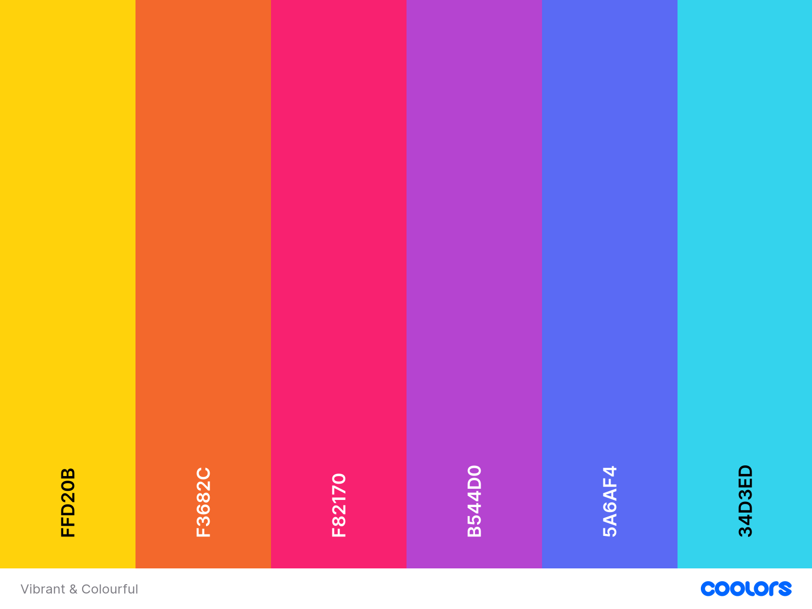
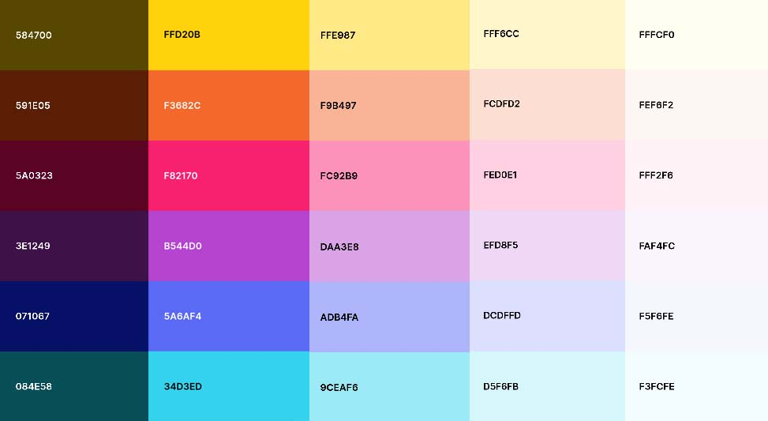
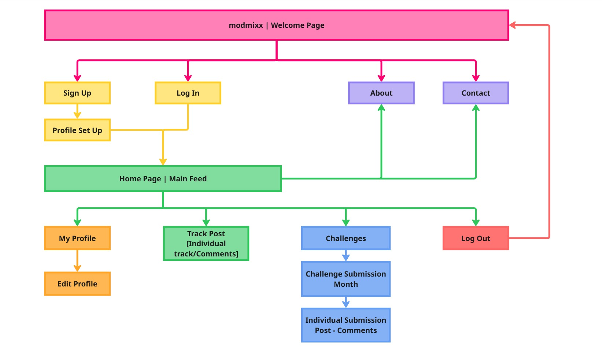
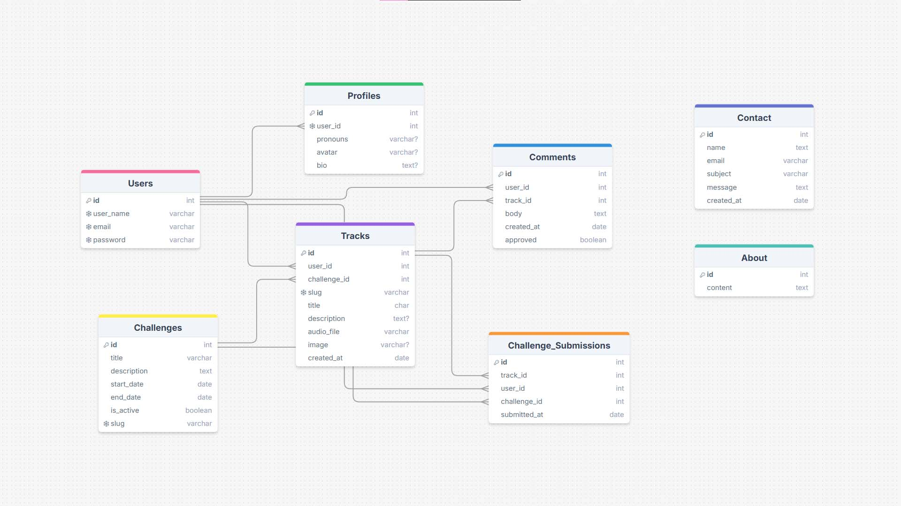
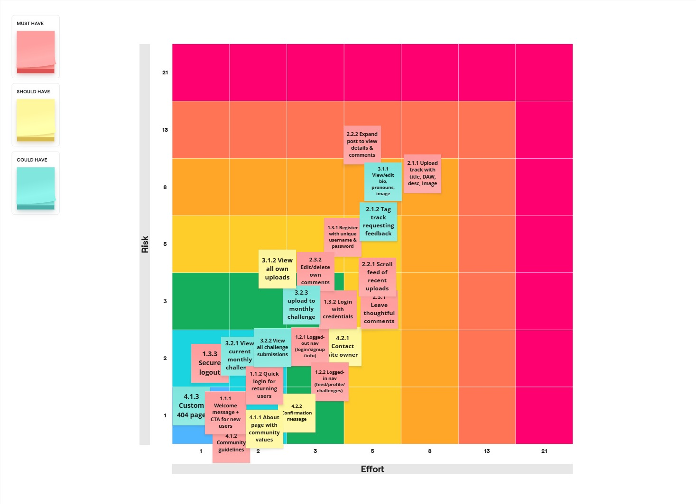

# modmixx

## Project Overview

**modmixx** is a web-based platform designed to foster creativity and collaboration among music makers of all skill levels. It provides a safe, inclusive space where users can share unfinished ideas, learn from others, and build meaningful connections. The platform prioritizes creativity over perfection and community over competition, offering an alternative to traditional self-promotion-focused platforms.

---

# Table of Contents

1. [Project Overview](#project-overview)
2. [Purpose and Objectives](#purpose-and-objectives)
3. [Concept Goals](#concept-goals)

## Purpose and Objectives

The music industry is undergoing significant changes, with independent artists facing challenges such as declining revenue from streaming platforms and the increasing use of AI-generated content by major record labels. These trends risk devaluing original, human-made music. However, the intrinsic value of music as a medium for creativity, connection, and community remains undiminished.

Music production offers benefits beyond financial gain, fostering personal growth, creative expression, and cognitive development. Skills such as synthesis, audio design, and instrument mastery (e.g., MIDI controllers or drum machines) have been shown to enhance brain health and support lifelong learning.

This project, **modmixx**, addresses the need for an inclusive, low-pressure environment where music creators—particularly beginners, hobbyists, and underrepresented voices—can share, experiment, and learn. Unlike existing platforms that prioritize polished content and algorithmic visibility, modmixx emphasizes sincerity, experimentation, and collaboration.

Developed as part of a full-stack web development diploma assessment, this platform is designed to demonstrate technical proficiency while addressing a real-world problem. The project is intended for long-term development, with the potential to evolve into a fully realized community-driven platform.

---

## Concept Goals

- **Creative Playground**: A space for users to upload musical ideas, sketches, and tracks without fear of judgment.
- **Inclusive by Design**: Actively supports women, trans, and non-binary creators while welcoming allies who share collaborative values.
- **Learning Through Sharing**: Encourages users to share their creative processes (e.g., DAW, techniques, effects) to inspire and educate others.
- **Community & Feedback**: Promotes thoughtful, collaborative feedback rather than criticism.
- **Challenges**: Monthly creative prompts to inspire participation and experimentation.
- **Connection, Not Clout**: Eliminates follower counts to focus on genuine creative exchange rather than competition.

---

## Core Features

- **Welcome Page**: Introduces users to the platform and its values.
- **Navigation Bar**: Provides intuitive access to key sections.
- **User Authentication**: Secure registration, login, and logout functionality.
- **Track Uploads**: Allows users to upload tracks with metadata (title, DAW used, description, optional image).
- **Main Feed**: Displays user uploads for discovery and engagement.
- **Commenting System**: Enables collaborative feedback on tracks.
- **User Profiles**: Includes pronouns, bio, profile picture, and uploaded tracks.
- **Challenges Page**: Features monthly challenges and user submissions.
- **Static Pages**: Includes About, Community Guidelines, and 404 pages.
- **Contact Form**: Allows users to provide feedback or request support.

---

## Future Features

- **Learning Content**: Tutorials, masterclasses, mentorship, and 1-to-1 lessons.
- **Social Features**: Follow/friend functionality with personalized feeds.
- **Collaboration Tools**: Direct messaging and shared project spaces.
- **Forum**: A dedicated space for sharing free resources and discussions.
- **Blog Section**: Updates and insights from the community.
- **Engagement Tools**: Like button (with hidden counts) and a report button for moderation.

## Planning

### Wireframes

#### Welcome Landing Page

#### Sign Up Page

#### Profile Setup Page

#### Log In Page

#### Main Feed Home Page

#### Individual Post/Track & Comments Page

#### Create Post Form

#### User Profile Page

#### Edit Profile Page

#### About Page

#### Contact Page

#### Error Page

#### Challenges Feed Page

#### Challenge Details Page and Submissions

### Colour Palette

#### Palette Brightness Variations

### Accessibility

#### Contrast 

### Typography

### Site Map

### User Flow Diagrams

#### User Flow for New User Sign Up

#### User Flow for Existing User Posting a Challenge Track

#### User Flow for User Commenting on a Track

#### User Flow for User Editing Their Profile

### ERD 

# Agile Project Management

Agile methodology was used for project management, with a focus on iterative development and reassessment. The project was divided into sprints, each lasting two weeks, allowing for regular reflection and adjustments based on scope and feedback.

### User Personas
Personas were created to represent the target users of the application, helping to guide design and development decisions.

👤 <strong>User Persona 1: Ava - The Curious Hobbyist</strong>

**Uses:** Freeware like GarageBand, BandLab  
**Experience Level:** Beginner / Hobbyist  
**Age Range:** 18–30  
**Pronouns:** She/Her

**Goals:**
- Share early music ideas without fear of judgment  
- Learn how other people build tracks (DAW, FX chains, etc.)  
- Connect with other female/female-identifying and non-binary producers

**Frustrations:**
- Other platforms feel performative, competitive, or male-dominated  
- Gets little to no feedback - just likes/hearts  
- Feels like there's an “entry bar” just to post anything

**Needs:**
- A space where messy creativity is celebrated  
- Encouragement to grow, not perform
- A safe space with protections against toxic or inappropriate interactions

**User Story:**  
_As a beginner producer, I want to upload unfinished tracks without fear, so that I can get support and learn from others._

🎚️ <strong>User Persona 2: Jules - The Burnt-Out Pro</strong>

**Uses:** Ableton Live, plugins like Serum  
**Experience Level:** Professional / Advanced  
**Age Range:** 30–45  
**Pronouns:** They/Them

**Goals:**
- Explore new genres outside of “client work”  
- Give back by mentoring or helping beginners  
- Play without branding pressure

**Frustrations:**
- Platforms feel like an extension of work/branding  
- Feels pressure to always share “portfolio-ready” content  
- Doesn't want to keep curating a public persona

**Needs:**
- A low-stakes, fun space to make weird music  
- Opportunities to teach/share knowledge organically

**User Story:**  
_As an experienced producer, I want to share ideas without “branding,” so that I can reconnect with music as play._

🎵 <strong>User Persona 3: Diane - The Rediscovering Creative</strong>

**Background:** Recently became an empty nester. Used to write songs and dabble in music 30 years ago but stopped when life got busy. Now exploring digital music tools (DAWs, loops, etc.) and wants a hobby that feels meaningful and social.

**Goals:**
- Reconnect with her creative side  
- Learn digital music production at her own pace  
- Be part of a kind, intergenerational community

**Frustrations:**
- Feels too old for YouTube comment sections, Discord servers or TikTok  
- Tech culture feels like it’s “not for her”  
- Intimidated by forums that assume prior knowledge  
- Real life social circle doesn't share her interest in producing beats

**Needs:**
- A gentle, welcoming space with no age assumptions  
- Encouragement and space to learn

**User Story:**  
_As an older woman rediscovering music, I want to find a friendly space that values creative exploration, so that I feel confident sharing and learning without judgment or pressure to be “pro.”_

🎧 <strong>User Persona 4: Emmi - The Shy Beginner</strong>

**Uses:** Logic Pro, sometimes GarageBand on iPad  
**Experience Level:** Beginner - Intermediate  
**Age Range:** 16–25  
**Pronouns:** She/Her

**Goals:**
- Share a track for the first time  
- Connect with others at a similar level  
- Be inspired by others who post “in-progress” music

**Frustrations:**
- Intimidated by polished production  
- Doesn’t feel “good enough” to belong on music platforms  
- Scared of negative or no feedback

**Needs:**
- A welcoming, feedback-focused space  
- Examples of imperfection being OK

**User Story:**  
_As a beginner learning music production, I want to share my work without judgment, so I can build confidence._

🎛️ <strong>User Persona 5: Jesse - The Experimental Collaborator</strong>

**Uses:** Avid Pro Tools  
**Experience Level:** Intermediate  
**Age Range:** 18–30  
**Pronouns:** He/Him

**Goals:**
- Build creative friendships through music  
- Collaborate on experimental projects  
- Find others to collab with or remix

**Frustrations:**
- Forums and collab spaces often feel cliquey, competitive, or ego-driven  
- Finds online collabs break down due to miscommunication or lack of follow-through  
- Misses the community vibe of in-person jam sessions  
- Finds algorithmic platforms reward polish over playfulness

**Needs:**
- A platform that encourages collaboration through openness and shared values  
- Clear ways to indicate openness to collab or remix  
- Community norms that reward sincerity and creativity over self-promotion  
- A vibe that feels like “a band room online” - playful, trusting, inspiring

**User Story:**  
_As a seasoned music producer who thrives on collaboration, I want to find a space where experimentation is encouraged and users are open to sharing project files or stems, so that I can co-create without the pressure of perfection or self-promotion._

🛠️ <strong>Site Owner - Developer</strong>

**Uses:** Ableton Live  
**Experience Level:** Professional / Advanced  

**Goals:**
- Build a welcoming community for music creativity  
- Reduce barriers to entry for marginalised people in music tech  
- Focus on fun, honesty, connection, learning - not performance or clout  
- A music producers hangout/playground

**Frustrations:**
- Music spaces dominated by perfectionism and ego  
- Toxic gatekeeping in production communities  
- Beginners feeling too intimidated to start

**User Story:**  
_As the developer, I want to build a platform that encourages authenticity over polish, so that music creators of all levels and backgrounds feel they belong._

## Themes, Epics, and User Stories
The project was organized into themes, epics, and user stories to ensure a user-centered approach to development. Each theme represents a key area of focus, with epics breaking down larger goals into manageable user stories.

## **Theme 1: Onboarding & Identity**

### **Epic 1.1: Homepage Welcome**

### User Stories:

|Story Number       |  User Story |  Story Point |
|-------|---|---|
|**1.1.1** |  _As a new visitor, I want to see a welcoming message and clear call to action, so that I    understand what the site is for and feel encouraged to join._ |  2 |
|**1.1.2** |  _As a returning user, I want a quick log in option, so that I can easily access my account._ |  2 |

### **Epic 1.2: Navigation**

### User Stories:

|Story Number       |  User Story |  Story Point |
|-------|---|---|
|**1.2.1** |  _As a logged-out user, I want clear links to log in, sign up, and learn more, so that I can easily navigate the site._ |  3 |
|**1.2.2** |  _As a logged-in user, I want navigation to change dynamically, so I can access relevant parts of the site like feed, profile, and challenges._ |  5 |

### **Epic 1.3: User Accounts**

### User Stories:

| Story Number | User Story                                                                                                              | Story Point |
| ------------ | ----------------------------------------------------------------------------------------------------------------------- | ----------- |
| **1.3.1**    | *As a new user, I want to register with a unique username and secure password, so that I can create an account safely.* | 5          |
| **1.3.2**    | *As a returning user, I want to log in with my credentials, so that I can access my profile and uploads.*               | 3           |
| **1.3.3**    | *As a logged-in user, I want to log out securely, so that my session ends safely.*                                      | 2          |

## **Theme 2: Music Sharing & Discovery**

### **Epic 2.1: Track Uploads**

### User Stories:

|Story Number | User Story                                                                                                                                     | Story Point |
| ------------ | ---------------------------------------------------------------------------------------------------------------------------------------------- | ----------- |
| **2.1.1**    | *As a user, I want to upload a music track with a title, DAW used, description, and image, so that others can understand my creative process.* | 8          |
| **2.1.2**    | *As a user, I want to tag my upload with 'feedback wanted' so that others know I am looking for constructive feedback.*                        | 5           |

### **Epic 2.2: Track Feed**

### User Stories:

|Story Number | User Story                                                                                                               | Story Point |
| ------------ | ------------------------------------------------------------------------------------------------------------------------ | ----------- |
| **2.2.1**    | *As a user, I want to scroll through a feed of recent uploads, so that I can discover and listen to other users’ music.* | 5           |
| **2.2.2**    | *As a user, I want to open a track post to see more details and comments, so that I can learn and engage more deeply.*   | 5           |

### **Epic 2.3: Comments**

### User Stories:

| Story Number | User Story                                                                                                  | Story Point |
| ------------ | ----------------------------------------------------------------------------------------------------------- | ----------- |
| **2.3.1**    | *As a user, I want to leave thoughtful comments on tracks, so that I can encourage and engage with others.* | 5           |
| **2.3.2**    | *As a user, I want to edit or delete my own comments, so that I can correct or remove what I wrote.*        | 3           |

## **Theme 3: Belonging & Connection**

### **Epic 3.1: User Profiles**

### User Stories:

| Story Number | User Story                                                                                                      | Story Point |
| ------------ | --------------------------------------------------------------------------------------------------------------- | ----------- |
| **3.1.1**    | *As a user, I want to view and edit my profile (bio, pronouns, image), so that others can understand who I am.* | 5           |
| **3.1.2**    | *As a user, I want to see all my uploaded tracks in one place, so that I can track my creative progress.*       | 3          |

### **Epic 3.2: Monthly Challenges**

### User Stories:

| Story Number | User Story                                                                                                      | Story Point |
| ------------ | --------------------------------------------------------------------------------------------------------------- | ----------- |
| **3.2.1**    | *As a user, I want to view the current monthly challenge, so that I can be inspired and participate.*           | 3           |
| **3.2.2**    | *As a user, I want to see other user submissions for the challenge, so that I feel part of a community effort.* | 2           |
| **3.2.3**    | *As a user, I want to upload my monthly challenge, so that my track is grouped with other submissions.*   | 2           |

## **Theme 4: Trust & Support**

### **Epic 4.1: Static Information Pages**

### User Stories:

| Story Number | User Story                                                                                                   | Story Point |
| ------------ | ------------------------------------------------------------------------------------------------------------ | ----------- |
| **4.1.1**    | *As a visitor, I want to read about the community and its values, so I know if it’s right for me.*           | 1           |
| **4.1.2**    | *As a user, I want clear community guidelines, so that I understand what’s expected and what’s not allowed.* | 2           |
| **4.1.3**    | *As a user, I want to see a helpful 404/504 page if something is missing, so I’m not confused.*              | 1           |

### **Epic 4.2: Contact & Support**

### User Stories:

| Story Number | User Story                                                                                                         | Story Point |
| ------------ | ------------------------------------------------------------------------------------------------------------------ | ----------- |
| **4.2.1**    | *As a visitor or user, I want to contact the site owner for help or feedback, so that I feel heard and supported.* | 3           |
| **4.2.2**    | *As a user, I want to receive a confirmation message when I submit the form, so I know it went through.*           | 2           |

## User Stories for Future Features
### Follow/Friend Users

| User Story                                                                                                              |
| ----------------------------------------------------------------------------------------------------------------------- |
| *As a user, I want to view other users' profile pages, so that I can view their info and listen to their other tracks.* |
| *As a user, I want to follow other users, so that I can easily find people whose work inspires me.*                     |
| *As a user, I want a feed of my followed users, so that I can keep up with their uploads.*                              |

### Messaging & Collaboration

| User Story                                                                                                   |
| ------------------------------------------------------------------------------------------------------------ |
| *As a user, I want to send messages or collaborate with others, so that I can build creative relationships.* |
| *As a user, I want to organize projects with collaborators, so that we can stay on track.*                   |

### Tiered Learning Content

| User Story                                                                                        |
| ------------------------------------------------------------------------------------------------- |
| *As a beginner, I want access to tutorials or 1-to-1 tutorship, so that I can improve my skills.* |
| *As a pro, I want to offer lessons or feedback, so that I can help others and give back.*         |

### Forum & Resources

| User Story                                                                                                     |
| -------------------------------------------------------------------------------------------------------------- |
| *As a user, I want to browse and share production resources, so that I can learn and contribute.*              |
| *As a user, I want a forum space to discuss specific production topics, so that I can find community support.* |

## Like Button (Hidden Count)

| User Story                                                                                           |
| ---------------------------------------------------------------------------------------------------- |
| *As a user, I want to report inappropriate content, so that the community stays safe and welcoming.* |

### Report Button

| User Story                                                                                           |
| ---------------------------------------------------------------------------------------------------- |
| *As a user, I want to report inappropriate content, so that the community stays safe and welcoming.* |

#### Fibonacci Sequence for Estimation
The Fibonacci sequence was used for estimating the complexity of tasks, helping to prioritize features and manage workload effectively. 

#### Fibonacci Effort vs Risk Matrix
