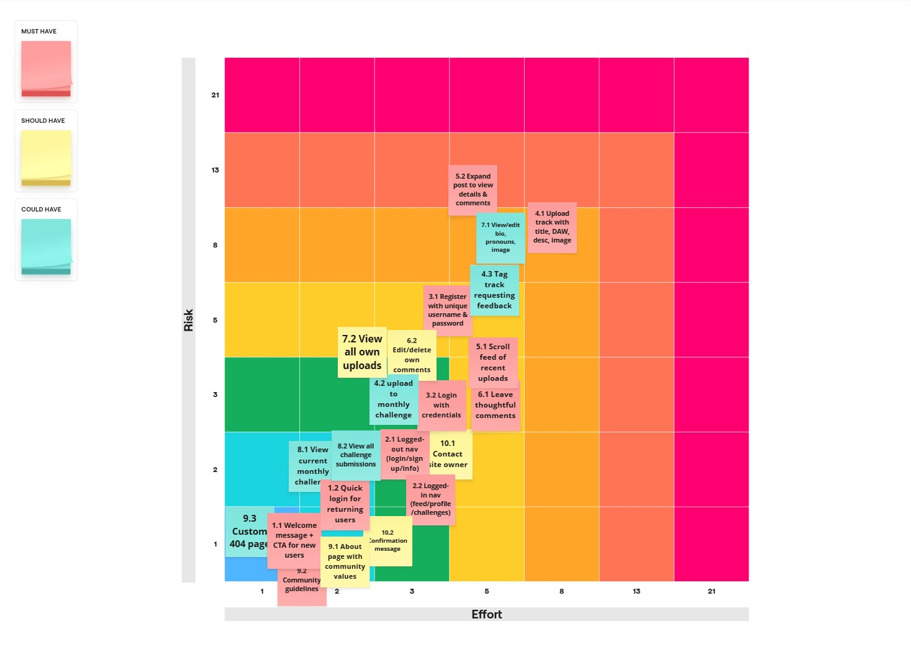

# modmixx

## Planning

### Wireframes

#### Welcome Landing Page

#### Sign Up Page

#### Profile Setup Page

#### Log In Page

#### Main Feed Home Page

#### Individual Post/Track & Comments Page

#### Create Post Form

#### User Profile Page

#### Edit Profile Page

#### About Page

#### Contact Page

#### Error Page

#### Challenges Feed Page

#### Challenge Details Page and Submissions

### Site Map

### User Flow Diagrams

#### User Flow for New User Sign Up

#### User Flow for Existing User Posting a Challenge Track

#### User Flow for User Commenting on a Track

#### User Flow for User Editing Their Profile

### ERD 

# Agile Project Management

Agile methodology was used for project management, with a focus on iterative development and reassessment. The project was divided into sprints, each lasting two weeks, allowing for regular reflection and adjustments based on scope and feedback.

### User Personas
Personas were created to represent the target users of the application, helping to guide design and development decisions.

### Epic 1: Set Up
### User Stories:

### Epic 2:
### User Stories: 

#### Fibonacci Sequence for Estimation
The Fibonacci sequence was used for estimating the complexity of tasks, helping to prioritize features and manage workload effectively. 

#### Fibonacci Effort vs Risk Matrix
