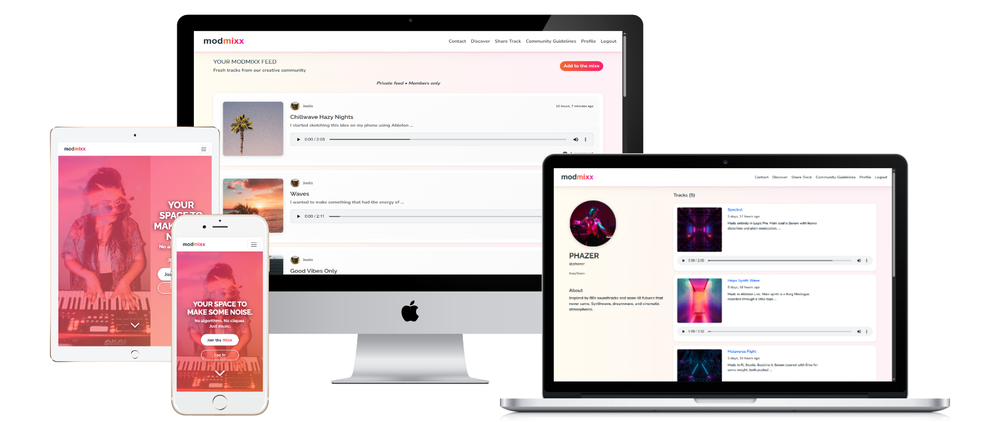

# modmixx


## Tech Stack


# Table of Contents

1. [Project Overview](#project-overview)
2. [Purpose, Industry Context and Objectives](#purpose-industry-context-and-objectives)
3. [Concept Goals](#concept-goals)
4. [Core Features](#core-features)
5. [Future Features](#future-features)
6. [Planning](#planning)
   - [Wireframes](#wireframes)
   - [Colour Palette - MVP Implementation](#colour-palette---mvp-implementation)
7. [Accessibility](#accessibility)
   - [Colour Contrast & Visual Design](#colour-contrast--visual-design)
8. [Typography](#typography)
9. [Design Process & Documentation](#design-process--documentation)
10. [Site Map](#site-map)
11. [User Flow Diagrams](#user-flow-diagrams)
12. [ERD](#erd)
13. [Agile Project Management](#agile-project-management)
14. [Themes, Epics, and User Stories](#themes-epics-and-user-stories)
    - [Theme 1: Onboarding & Identity](#theme-1-onboarding--identity)
      - [Epic 1.1: Homepage Welcome](#epic-11-homepage-welcome)
      - [Epic 1.2: Navigation](#epic-12-navigation)
      - [Epic 1.3: User Accounts](#epic-13-user-accounts)
    - [Theme 2: Music Sharing & Discovery](#theme-2-music-sharing--discovery)
      - [Epic 2.1: Track Uploads](#epic-21-track-uploads)
      - [Epic 2.2: Track Feed](#epic-22-track-feed)
      - [Epic 2.3: Comments](#epic-23-comments)
    - [Theme 3: Belonging & Connection](#theme-3-belonging--connection)
      - [Epic 3.1: User Profiles](#epic-31-user-profiles)
      - [Epic 3.2: Monthly Challenges](#epic-32-monthly-challenges)
    - [Theme 4: Trust & Support](#theme-4-trust--support)
      - [Epic 4.1: Static Information Pages](#epic-41-static-information-pages)
      - [Epic 4.2: Contact & Support](#epic-42-contact--support)
    - [User Stories for Future Features](#user-stories-for-future-features)
15. [Fibonacci Sequence for Estimation](#fibonacci-sequence-for-estimation)
16. [GitHub Projects & Agile Implementation](#github-projects--agile-implementation)
17. [Technologies Used](#technologies-used)
    - [Languages & Frameworks](#languages--frameworks)
    - [Frontend Technologies & UI](#frontend-technologies--ui)
    - [JavaScript APIs & Browser Features](#javascript-apis--browser-features)
    - [Backend & Database](#backend--database)
    - [Authentication & Security](#authentication--security)
    - [Cloud Services & APIs](#cloud-services--apis)
    - [File Processing](#file-processing)
    - [Development & Deployment](#development--deployment)
    - [Code Quality Tools](#code-quality-tools)
18. [Site Features](#site-features)
19. [Deployment](#deployment)
20. [Testing](#testing)
21. [Future Enhancements](#future-enhancements)
22. [Credits & References](#credits--references)
23. [Acknowledgements](#acknowledgements)

## Project Overview

**modmixx** is a web-based platform designed to foster creativity and collaboration among music makers of all skill levels. It provides a safe, inclusive space where users can share unfinished ideas, learn from others, and build meaningful connections. The platform prioritises creativity over perfection and community over competition, offering an alternative to traditional self-promotion-focused platforms.

[Live Site](https://modmixx-427f89e87a1b.herokuapp.com/)  

---
 

## Purpose, Industry Context and Objectives

The music industry is undergoing significant transformation, presenting both challenges and opportunities for independent artists. With declining revenue from streaming platforms and the rise of AI-generated content, original, human-made music risks being undervalued. Despite these shifts, the demand for creativity, connection, and community in music remains as strong as ever.

Simultaneously, music creation tools have become more accessible than ever before. The market for both professional and hobbyist hardware continues to thrive, from analogue synthesizers to MIDI controllers. Additionally, powerful free software including Digital Audio Workstations (DAWs), VST plugins, and sample libraries have dramatically lowered barriers to entry, empowering a new generation of creators. This democratisation of production tools has expanded the community of music makers, creating a need for platforms that genuinely support their creative journey.

**modmixx** addresses this gap by providing a dedicated space where music creators of all skill levels can share, experiment, and grow without the pressure of perfection or competition that characterises existing platforms. Unlike traditional social media that prioritises polished content and algorithmic visibility, modmixx fosters authentic creativity, collaboration, and experimentation.

The platform's focus on authentic creativity and community building creates natural opportunities for meaningful partnerships with the hardware and software brands that creators use daily. When users share their creative processes and the tools that enable their work, it builds genuine, trust-based connections between creators and the brands that support their journey.

With its emphasis on inclusivity and authentic connection, modmixx has the potential to evolve into a thriving, user-driven platform that truly empowers creators while establishing valuable partnerships that benefit the entire community.

---

## Concept Goals

- **Creative Playground**: A space for users to upload musical ideas, sketches, and tracks without fear of judgment.
- **A Safe & Inclusive Space**: Prioritises a safe and welcoming environment for all creators, with a focus on amplifying voices often underrepresented in the music industry.
- **Learning Through Sharing**: Encourages users to share their creative processes (e.g., DAW, techniques, effects) to inspire and educate others.
- **Community & Feedback**: Promotes thoughtful, collaborative feedback rather than criticism.
- **Connection, Not Clout**: Eliminates follower counts to focus on genuine creative exchange rather than competition.

---

## Core Features

- **Welcome Page**: Introduces users to the platform and its values.
- **Navigation Bar**: Provides intuitive access to key sections.
- **User Authentication**: Secure registration, login, and logout functionality.
- **Track Uploads**: Allows users to upload tracks with metadata (title, DAW used, description, optional image).
- **Main Feed**: Displays user uploads for discovery and engagement.
- **Commenting System**: Enables collaborative feedback on tracks.
- **User Profiles**: Includes pronouns, bio, profile picture, and uploaded tracks.
- **Static Pages**: Includes About, Community Guidelines, and 404 pages.
- **Contact Form**: Allows users to provide feedback or request support.

---

## Future Features

- **Challenges**: Monthly creative prompts to inspire participation and experimentation.
- **Learning Content**: Tutorials, masterclasses, and mentorship opportunities featuring a diverse range of artists and producers to ensure representation and broad perspectives.
- **Social Features**: Follow/friend functionality with personalized feeds.
- **Collaboration Tools**: Direct messaging and shared project spaces.
- **Forum**: A dedicated space for sharing free resources and discussions.
- **Blog Section**: Updates and insights from the community.
- **Engagement Tools**: Like button (with hidden counts) and a report button for moderation.
- **Video Integration**: Support for short performance video uploads and sharing.
- **Listening Parties**: Real-time collaborative listening sessions. Recreating the feel of in-person jam sessions and open mic nights.


## Planning

[Miro modmixx Planning Board](https://miro.com/app/board/uXjVIjLi6S0=/?share_link_id=959911845180)

### Wireframes

#### Welcome Landing Page


#### Sign Up Page


#### Profile Setup Page


#### Log In Page


#### Main Feed Home Page


#### Individual Post/Track & Comments Page


#### Create Post Form


#### User Profile Page


#### Edit Profile Page


#### About Page


#### Contact Page


#### Error Page


#### Challenges Feed Page


#### Challenge Details Page and Submissions


### Colour Palette


**Primary Brand Colours:**
- **Yellow**: #FFD20B 
- **Orange**: #F3682C   
- **Pink**: #F82170 
- **Purple**: #B544D0

**Interface Colours:**
- **Background**: #FFFFFF (Clean white base)
- **Text**: #24343c (Charcoal black for readability)
- **Gradient Backgrounds**: 
  - #FFFCF0 (Pale cream)
  - #FEF6F2 (Soft peach) 
  - #FFF2F6 (Light pink)

**Design Approach:**
The interface emphasises clean white space and visual breathing room, with subtle pale gradient backgrounds in near off-white tones (#FFFCF0 → #FEF6F2 → #FFF2F6). This creates a way to introduce colour without overwhelming the user experience. Interactive elements feature vibrant orange-to-pink gradients with white text for clear call-to-action visibility, while maintaining accessibility and readability throughout.

*Note: The MVP colour palette is documented in detail, while the complete brand palette is maintained in CSS custom properties for consistent design system implementation and future development phases.*

## Accessibility

#### Colour Contrast & Visual Design

Accessibility was prioritised from the planning phase through implementation and testing. Colour contrast ratios were carefully evaluated and tested throughout the development process to ensure WCAG compliance.

**Planning Phase:**
- Colour contrast combinations were evaluated during design planning using WebAIM contrast checker
- Multiple contrast scenarios documented on Miro planning board with screenshots
- Accessibility considerations informed colour palette decisions from the start

**Implementation Phase:**
- Continuous contrast testing during development using eyedropper tools and WebAIM contrast checker
- Strategic design decisions made to enhance readability and user experience, including:
  - Hero overlay gradient with 70% opacity for sufficient background contrast
  - Gradient overlay prevents hero image from detracting attention from CTA buttons and headline
  - Text shadows and box shadows added to improve text legibility over images
  - White text on gradient overlays tested for contrast ratios

**Example - Hero Section Design Strategy:**
```css
/* Hero brand pink to orange gradient overlay for contrast enhancement */
.hero-gradient-overlay {
    background: linear-gradient(135deg, rgba(248,33,112,0.7) 0%, rgba(243,104,44,0.7) 100%);
} 

/* Deep burgundy text shadow for enhanced readability */
.hero-text {
    text-shadow: 0px 3px 20px rgba(84, 6, 35); 
}

```

### Typography


**Primary Fonts:**
**Nunito** - Main body font, clean and highly readable


**Raleway** - Headlines and subheadings in bold weights for visual hierarchy


**Design Strategy:**
Both fonts were chosen for exceptional readability across devices and accessibility compliance. Raleway's versatile weight range (100-900) provides strong visual hierarchy for headlines and taglines, while Nunito ensures comfortable reading for body content.

### Design Process & Documentation

For a comprehensive view of the complete design process, and planning documentation, visit the project planning board:

**[View Complete Design Process on Miro →](https://miro.com/app/live-embed/uXjVIjLi6S0=/?embedMode=view_only_without_ui&moveToViewport=-9757%2C-5087%2C50008%2C25645&embedId=323941935999)**

*The Miro board contains detailed planning and research that informed the development of this MVP.*

### Site Map


### User Flow Diagrams

#### User Flow for New User Sign Up


#### User Flow for Existing User Posting a Challenge Track


*Note: This user flow represents planned functionality for monthly challenges, which were strategically deferred from the MVP scope to prioritise core platform features. Challenge functionality provides greater community value once the platform has established its user base and proven engagement with core features. The challenges feature is planned for future development phases.*

#### User Flow for User Commenting on a Track


#### User Flow for User Editing Their Profile


### ERD 

*Entity Relationship Diagram showing the core data structure: User authentication, Profile management, Track uploads with S3 storage (PATH), Comments, and Contact form functionality.*


# Agile Project Management

Agile methodology was used for project management, with a focus on iterative development and reassessment. The project was broken down into manageable themes, epics, and user stories to ensure a user-centered approach to development. 

### User Personas
Personas were created to represent the target users of the application, helping to guide design and development decisions.

<details>
<summary><strong>User Persona 1: Ava - The Curious Hobbyist</strong></summary>

**Uses:** Freeware like GarageBand, BandLab  
**Experience Level:** Beginner / Hobbyist  
**Age Range:** 18–30  
**Pronouns:** She/Her

**Goals:**
- Share early music ideas without fear of judgment  
- Learn how other people build tracks (DAW, FX chains, etc.)  
- Connect with other female/female-identifying and non-binary producers

**Frustrations:**
- Other platforms feel performative, competitive, or male-dominated  
- Gets little to no feedback - just likes/hearts  
- Feels like there's an “entry bar” just to post anything

**Needs:**
- A space where messy creativity is celebrated  
- Encouragement to grow, not perform
- A safe space with protections against toxic or inappropriate interactions

**User Story:**  
_As a beginner producer, I want to upload unfinished tracks without fear, so that I can get support and learn from others._

</details>

<details>
<summary><strong>User Persona 2: Jules - The Burnt-Out Pro</strong></summary>

**Uses:** Ableton Live, plugins like Serum  
**Experience Level:** Professional / Advanced  
**Age Range:** 30–45  
**Pronouns:** They/Them

**Goals:**
- Explore new genres outside of “client work”  
- Give back by mentoring or helping beginners  
- Play without branding pressure

**Frustrations:**
- Platforms feel like an extension of work/branding  
- Feels pressure to always share “portfolio-ready” content  
- Doesn't want to keep curating a public persona

**Needs:**
- A low-stakes, fun space to make weird music  
- Opportunities to teach/share knowledge organically

**User Story:**  
_As an experienced producer, I want to share ideas without “branding,” so that I can reconnect with music as play._

</details>

<details>
<summary><strong>User Persona 3: Diane - The Rediscovering Creative</strong></summary>

**Background:** Recently became an empty nester. Used to write songs and dabble in music 30 years ago but stopped when life got busy. Now exploring digital music tools (DAWs, loops, etc.) and wants a hobby that feels meaningful and social.

**Goals:**
- Reconnect with her creative side  
- Learn digital music production at her own pace  
- Be part of a kind, intergenerational community

**Frustrations:**
- Feels too old for YouTube comment sections, Discord servers or TikTok  
- Tech culture feels like it’s “not for her”  
- Intimidated by forums that assume prior knowledge  
- Real life social circle doesn't share her interest in producing beats

**Needs:**
- A gentle, welcoming space with no age assumptions  
- Encouragement and space to learn

**User Story:**  
_As an older woman rediscovering music, I want to find a friendly space that values creative exploration, so that I feel confident sharing and learning without judgment or pressure to be “pro.”_

</details>

<details>
<summary><strong>User Persona 4: Emmi - The Shy Beginner</strong></summary>

**Uses:** Logic Pro, sometimes GarageBand on iPad  
**Experience Level:** Beginner - Intermediate  
**Age Range:** 16–25  
**Pronouns:** She/Her

**Goals:**
- Share a track for the first time  
- Connect with others at a similar level  
- Be inspired by others who post “in-progress” music

**Frustrations:**
- Intimidated by polished production  
- Doesn’t feel “good enough” to belong on music platforms  
- Scared of negative or no feedback

**Needs:**
- A welcoming, feedback-focused space  
- Examples of imperfection being OK

**User Story:**  
_As a beginner learning music production, I want to share my work without judgment, so I can build confidence._

</details>

<details>
<summary><strong>User Persona 5: Jesse - The Experimental Collaborator</strong></summary>

**Uses:** Avid Pro Tools  
**Experience Level:** Intermediate  
**Age Range:** 18–30  
**Pronouns:** He/Him

**Goals:**
- Build creative friendships through music  
- Collaborate on experimental projects  
- Find others to collab with or remix

**Frustrations:**
- Forums and collab spaces often feel cliquey, competitive, or ego-driven  
- Finds online collabs break down due to miscommunication or lack of follow-through  
- Misses the community vibe of in-person jam sessions  
- Finds algorithmic platforms reward polish over playfulness

**Needs:**
- A platform that encourages collaboration through openness and shared values  
- Clear ways to indicate openness to collab or remix  
- Community norms that reward sincerity and creativity over self-promotion  
- A vibe that feels like “a band room online” - playful, trusting, inspiring

**User Story:**  
_As a seasoned music producer who thrives on collaboration, I want to find a space where experimentation is encouraged and users are open to sharing project files or stems, so that I can co-create without the pressure of perfection or self-promotion._

</details>

<details>
<summary><strong>Site Owner - Developer</strong></summary>

**Uses:** Ableton Live  
**Experience Level:** Professional / Advanced  

**Goals:**
- Build a welcoming community for music creativity  
- Reduce barriers to entry for people in music tech  
- Focus on fun, honesty, connection, learning - not performance or clout  
- A music producers hangout/playground

**Frustrations:**
- Music spaces dominated by perfectionism and ego  
- Toxic gatekeeping in production communities  
- Beginners feeling too intimidated to start

**User Story:**  
_As the developer, I want to build a platform that encourages authenticity over polish, so that music creators of all levels and backgrounds feel they belong._

</details>


## Themes, Epics, and User Stories
The project was organised into themes, epics, and user stories to ensure a user-centered approach to development. Each theme represents a key area of focus, with epics breaking down larger goals into manageable user stories.

## **Theme 1: Onboarding & Identity**

### **Epic 1.1: Homepage Welcome**

### User Stories:

|Story Number       |  User Story |  Story Point |
|-------|---|---|
|**1.1.1** |  _As a new visitor, I want to see a welcoming message and clear call to action, so that I    understand what the site is for and feel encouraged to join._ |  2 |
|**1.1.2** |  _As a returning user, I want a quick log in option, so that I can easily access my account._ |  2 |

### **Epic 1.2: Navigation**

### User Stories:

|Story Number       |  User Story |  Story Point |
|-------|---|---|
|**1.2.1** |  _As a logged-out user, I want clear links to log in, sign up, and learn more, so that I can easily navigate the site._ |  3 |
|**1.2.2** |  _As a logged‑in user, I want navigation to change dynamically, so I can access relevant parts of the site like feed and profile._ |  5 |

### **Epic 1.3: User Accounts**

### User Stories:

| Story Number | User Story                                                                                                              | Story Point |
| ------------ | ----------------------------------------------------------------------------------------------------------------------- | ----------- |
| **1.3.1**    | *As a new user, I want to register with my email address and a secure password, so that I can create an account safely.* | 5          |
| **1.3.2**    | *As a returning user, I want to log in with my credentials, so that I can access my profile and uploads.*               | 3           |
| **1.3.3**    | *As a logged-in user, I want to log out securely, so that my session ends safely.*                                      | 2          |


## **Theme 2: Music Sharing & Discovery**

### **Epic 2.1: Track Uploads**

**Note:** Track tagging functionality was deferred to future releases.

### User Stories:

|Story Number | User Story                                                                                                                                     | Story Point |
| ------------ | ---------------------------------------------------------------------------------------------------------------------------------------------- | ----------- |
| **2.1.1**    | *As a user, I want to upload a music track with a title, DAW used, description, and image, so that others can understand my creative process.* | 8          |
| **2.1.2**    | *As a user, I want to tag my upload with 'feedback wanted' so that others know I am looking for constructive feedback.* _**(Future Release)**_                        | 5           |
| **2.1.3**    | *As a user, I want to edit or delete my uploaded track post, so that I can update or remove content if needed.*                                   | 5           |

### **Epic 2.2: Track Feed**

### User Stories:

|Story Number | User Story                                                                                                               | Story Point |
| ------------ | ------------------------------------------------------------------------------------------------------------------------ | ----------- |
| **2.2.1**    | *As a user, I want to scroll through a feed of recent uploads, so that I can discover and listen to other users’ music.* | 5           |
| **2.2.2**    | *As a user, I want to open a track post to see more details and comments, so that I can learn and engage more deeply.*   | 5           |

### **Epic 2.3: Comments**

### User Stories:

| Story Number | User Story                                                                                                  | Story Point |
| ------------ | ----------------------------------------------------------------------------------------------------------- | ----------- |
| **2.3.1**    | *As a user, I want to leave thoughtful comments on tracks, so that I can encourage and engage with others.* | 5           |
| **2.3.2**    | *As a user, I want to edit or delete my own comments, so that I can correct or remove what I wrote.*        | 3           |


## **Theme 3: Belonging & Connection**

### **Epic 3.1: User Profiles**

### User Stories:

| Story Number | User Story                                                                                                      | Story Point |
| ------------ | --------------------------------------------------------------------------------------------------------------- | ----------- |
| **3.1.1**    | *As a user, I want to view and edit my profile (bio, pronouns, image), so that others can understand who I am.* | 5           |
| **3.1.2**    | *As a user, I want to see all my uploaded tracks in one place, so that I can track my creative progress.*       | 3          |


### **Epic 3.2: Monthly Challenges** *(Removed from MVP Scope)*

**Strategic MVP Decision:** Monthly challenges were initially planned but strategically deferred from the MVP scope to prioritise core platform functionality. This feature provides maximum value when there's sufficient user adoption and content volume to create meaningful community engagement. The MVP focuses on establishing the foundational user experience authentication, track sharing, and community interaction which are prerequisites for successful challenge participation. Monthly challenges will be implemented in future releases once the platform has grown its user base and proven the core value proposition.

### User Stories:

| Story Number | User Story                                                                                                      | Story Point |
| ------------ | --------------------------------------------------------------------------------------------------------------- | ----------- |
| **3.2.1**    | *As a user, I want to view the current monthly challenge, so that I can be inspired and participate.* _**(Future Release)**_          | 3           |
| **3.2.2**    | *As a user, I want to see other user submissions for the challenge, so that I feel part of a community effort.* _**(Future Release)**_ | 2           |
| **3.2.3**    | *As a user, I want to upload my monthly challenge, so that my track is grouped with other submissions.*  _**(Future Release)**_ | 2           |


## **Theme 4: Trust & Support**

### **Epic 4.1: Static Information Pages**

### User Stories:

| Story Number | User Story                                                                                                   | Story Point |
| ------------ | ------------------------------------------------------------------------------------------------------------ | ----------- |
| **4.1.1**    | *As a visitor, I want to read about the community and its values, so I know if it’s right for me.*           | 1           |
| **4.1.2**    | *As a user, I want clear community guidelines, so that I understand what’s expected and what’s not allowed.* | 2           |
| **4.1.3**    | *As a user, I want to see a helpful 404/504 page if something is missing, so I’m not confused.*              | 1           |


### **Epic 4.2: Contact & Support**

### User Stories:

| Story Number | User Story                                                                                                         | Story Point |
| ------------ | ------------------------------------------------------------------------------------------------------------------ | ----------- |
| **4.2.1**    | *As a visitor or user, I want to contact the site owner for help or feedback, so that I feel heard and supported.* | 3           |
| **4.2.2**    | *As a user, I want to receive a confirmation message when I submit the form, so I know it went through.*           | 2           |

## User Stories for Future Features
### Learning & Mentorship

| User Story                                                                                                              |
| ----------------------------------------------------------------------------------------------------------------------- |
| *As a beginner/intermediate user, I want access to tutorials, mentorship, and learning content, so that I can improve my skills in a supportive environment.* |
| *As an experienced producer, I want to offer lessons or feedback to others, so that I can give back to the community and share my expertise.* |

### Social & Collaborative Features

| User Story                                                                                                   |
| ------------------------------------------------------------------------------------------------------------ |
| *As a user, I want to follow or friend other users, so that I can stay connected with artists whose work I admire.* |
| *As a user, I want a personalised feed of uploads from users I follow, so that I can easily discover new tracks from my creative circle.*                   |
| *As a user, I want to message or collaborate directly with others, so that we can create music together and stay on track with shared projects.* |


### Community & Forums

| User Story                                                                                                     |
| -------------------------------------------------------------------------------------------------------------- |
| *As a user, I want a forum or discussion area to ask questions and share production tips, so that I can learn and connect with others.*              |
| *As a user, I want to browse and contribute free production resources, so that I can both benefit from and support the community.* |


## Engagement Tools

| User Story                                                                                           |
| ---------------------------------------------------------------------------------------------------- |
| *As a user, I want to like tracks privately (with no visible counts), so that I can show appreciation without promoting competition.* |
| *As a user, I want to report inappropriate content, so that the community stays safe and welcoming.* |


### Media & Events

| User Story                                                                                           |
| ---------------------------------------------------------------------------------------------------- |
| *As a user, I want to upload and share short performance videos, so that I can showcase my creative process and style.* |
| *As a user, I want to participate in real-time listening parties, so that I can experience the joy of sharing music live with others.* |


#### Fibonacci Sequence for Estimation
The Fibonacci sequence was used for estimating the complexity of user stories, helping to prioritise features and manage workload effectively.

#### Fibonacci Effort vs Risk Matrix


## GitHub Projects & Agile Implementation

### Project Management Methodology
This project utilised GitHub Projects with a comprehensive agile approach, implementing MoSCoW prioritisation (Must Have, Should Have, Could Have, Won't Have) combined with iterative development cycles.

[Link to the modmixx Project Boards](https://github.com/users/Seren-Hughes/projects/8) 

### GitHub Projects Kanban Board
<details>
<summary><em>Click to expand</em><br>
MoSCoW prioritised user stories tracked through GitHub Projects with clear priority labels and sub-issue organisation
</summary>


</details>

### Iteration Planning & Management
<details>
<summary><em>Click to expand</em><br>
Six iteration cycles with milestone tracking and feature-focused sprint planning
</summary>


</details>

### Project Roadmap & Milestones
<details>
<summary><em>Click to expand</em><br>
Strategic milestone planning with deliverable tracking and timeline management
</summary>


</details>

### Iteration Breakdown

**Iteration 1: Accounts & Profiles**
- User registration and login functionality
- Profile management system

**Iteration 2: Tracks**
- Audio file upload functionality
- Track display in main feed
- Individual track page creation

**Iteration 3: Comments System**
- Comment model linking to tracks and users
- Comment form and display logic
- Moderation planning

**Iteration 4: AWS + Media Setup** *(Milestone: Storage & Backend)*
- AWS S3 integration for audio and image storage
- Production upload functionality testing
- Moderation implementation

**Iteration 5: UI + Forms + Auth Polish** *(Milestone: Frontend)*
- Bootstrap integration and responsive design
- Custom signup/login form styling
- Navigation and template optimization
- Content creation 

**Iteration 6: QA + Documentation + Testing** *(Milestones: Testing & Release 1 MVP)*
- Comprehensive testing implementation
- README documentation completion
- Screenshots and UX documentation
- MVP release preparation

**Deferred Feature: Challenges System** *(Planned for Release 2)*
- Monthly challenge model implementation
- Challenge-track linking functionality
- Upload logic extension for challenges

### Agile Development Impact

The agile approach allowed for flexibility and adaptability throughout the project. Regular iterations enabled continuous reassessment of priorities, leading to the strategic deferral of the challenges system to a future release. This ensured that core functionalities were delivered with high quality within the project timeline.

### Planning & Retrospectives Documentation
Detailed iteration planning, retrospectives, and strategic decision-making were documented on the project's Miro board:

[View Miro Planning Board - modmixx Project](https://miro.com/app/board/uXjVIjLi6S0=/?share_link_id=759006025965)


## Technologies Used

### Languages & Frameworks
- **HTML5** - Semantic structure and content
- **CSS3** - Styling, responsive layouts, custom properties
- **JavaScript (ES6+)** - Client-side interactivity and dynamic functionality
- **Python 3.13** - Backend application logic
- **Django 5.2.4** - Full-stack web framework with ORM and templating

### Frontend Technologies & UI
- **Bootstrap 5** - Responsive CSS framework and components
- **Django Crispy Forms 2.4** - Enhanced form rendering and styling
- **Crispy Bootstrap5 2025.6** - Bootstrap 5 integration for forms
- **Google Fonts** - Typography (Nunito, Raleway)
- **Font Awesome** - Iconography

### JavaScript APIs & Browser Features
- **Fetch API** - Modern AJAX for dynamic content loading
- **File API** - Drag-and-drop and file upload handling
- **Intersection Observer API** - Infinite scroll and lazy loading
- **HTML5 Audio API** - Audio playback and management for tracks
- **Bootstrap Modal & Toast API** - Enhanced UI feedback and modal management

### Backend & Database
- **PostgreSQL** - Primary relational database management (psycopg2)
- **Custom User Model** - Email-based authentication system
- **Django Signals** - Automated profile creation and model events
- **dj-database-url 3.0.1** - Database configuration management

### Authentication & Security
- **Django Allauth 65.10.0** - Comprehensive authentication system with Google OAuth
- **Google OAuth 2.0** - Social authentication for Google account sign-up/login
- **Custom Form Validation** - Multi-layered security with regex patterns
- **Honeypot Spam Protection** - Bot detection via hidden form fields
- **File Upload Security** - Type, size, and content validation
- **Content Moderation** - AI-powered filtering for text and images
- **GitGuardian** – Enhanced security monitoring and vulnerability detection

### Cloud Services & APIs
- **AWS S3** - Cloud storage for audio files and images
- **AWS Rekognition** - AI-powered image content moderation
- **Google Perspective API** - Real-time toxicity detection for text content by Google & Jigsaw
- **Gmail SMTP** - Email service for contact forms
- **Boto3 1.40.1** - AWS SDK for Python

### File Processing
- **Pillow 11.3.0** - Image processing and validation
- **Mutagen 1.47.0** - Audio file metadata extraction and duration calculation
- **Python-ULID 3.0.0** - Unique identifier generation for file naming

### Development & Deployment
- **GitHub** - Version control and repository management
- **VSCode** - Code editing and development environment
- **Heroku** - Application hosting and deployment
- **Gunicorn 23.0.0** - WSGI HTTP server for production
- **Whitenoise 6.9.0** - Static file serving in production
- **Django Storages 1.14.6** - Custom storage backends for S3

### Code Quality Tools
- **Black 25.1.0** - Python code formatter
- **Flake8 7.3.0** - Python linting and style guide enforcement
- **isort 6.0.1** - Python import statement sorting
- **djlint 1.36.4** - Django template linting and formatting
- **ESLint** - JavaScript linting and style guide enforcement

### Other Tools
- **GitHub Projects** - For agile project management and issue tracking
- **Miro** - Whiteboarding platform
- **Adobe Photoshop** - Graphic design and image editing
- **Adobe Illustrator** - Vector graphics editing and illustration
- **ChatGPT** - Used to refine written content and improve clarity in documentation. Also utilised for learning alongside traditional documentation and resources.
- **Coolors** - Colour palette generation tool
- **Drawdb** - ERD (Entity Relationship Diagram) design tool
- **Eyedropper** - Colour extraction tool for design


## Site Features

### Welcome & Landing Page


The landing page introduces new visitors to the modmixx community with a clear value proposition and welcoming design. Features include:
- **Hero Section** - Compelling call-to-action with gradient overlay for optimal text contrast
- **Community Values** - Clear messaging about creativity, inclusivity, and collaboration
- **Getting Started** - Streamlined signup/login options prominently displayed
- **Responsive Design** - Optimized experience across all device sizes

<details>
<summary><em>Click to expand the full page</em><br></summary>

</details>

### Dynamic Navigation System
**Contextual navigation that adapts based on user authentication status:**

**Pre-Authentication Navigation**


- Clear signup/login options
- Access to About and Contact pages
- Responsive collapse on mobile devices

**Post-Authentication Navigation**


- Feed access for track discovery
- Upload functionality for content creation
- Profile management
- Secure logout option

**Mobile-Responsive Design**


- Bootstrap 5 collapse component
- Touch-friendly interface
- Maintains full functionality on smaller screens

### User Registration & Authentication

**Multi-Modal Registration System:**
- **Email/Password Registration** - Traditional account creation with validation
- **Google OAuth Integration** - One-click social authentication
- **Profile Setup** - Immediate profile creation with username, display name, optional bio, pronouns, and profile image

### Main Feed


### Track Upload & Management System

**Comprehensive Upload Process:**
- **Drag-and-Drop Interface** - Intuitive file selection with visual feedback
- **Multi-Format Support** - Accepts various audio formats (MP3, WAV, M4A, etc.)
- **Rich Metadata Collection** - Title, description, DAW used, optional cover art
- **File Validation** - Security checks for file type, size, and content
- **AWS S3 Integration** - Secure cloud storage
- **Audio Processing** - Automatic duration extraction
- **Progress Feedback** - Real-time upload status and error handling

**Content Moderation Pipeline:**
- **Image Analysis** - AWS Rekognition for inappropriate visual content detection
- **Text Moderation** - Google Perspective API for toxicity and inappropriate language detection
- **Multi-Layer Security** - File type validation, size limits, and content scanning
- **Admin Override** - Manual moderation capabilities for edge cases

### Main Feed with Intelligent Loading
_(AKA lazy loading)_

**Initial Content Strategy:**
The main feed implements a performance-optimised loading strategy that balances user experience with server resources:

**Initial Load (5 Tracks):**
- Displays the 5 most recent tracks immediately
- Provides instant content engagement
- Reduces initial page load time
- Optimises AWS S3 data transfer costs - Only loads audio/image files for tracks currently being viewed
- Minimises bandwidth usage - Prevents unnecessary downloads of media files that users may never interact with
- Includes complete track information (audio player, metadata, comments)

**Infinite Scroll Implementation:**


*Demonstration with throttled connection speed to show loading behaviour*

**Technical Implementation:**
- **Intersection Observer API** - Efficient scroll detection without performance impact 
- **Loading States** - Visual feedback during content fetching

**Navigation Enhancement:**


- **Back to Top Button** - Smooth scroll functionality for long feeds
- **Dynamic Visibility** - Appears/disappears based on scroll position
- **Accessibility Compliance** - Keyboard navigation support

### Comment System

- **Threaded Comments** - Organised discussion structure


- **Real-Time Validation** - Immediate feedback on comment length and content
- **Edit/Delete Functionality** - User control over their contributions
- **Moderation Integration** - Google Perspective API powered content filtering for community safety
- **Responsive Design** - Optimised for mobile and desktop interaction

### AI-Powered Content Moderation

**Multi-Service Moderation Pipeline:**

**Image Content Analysis:**
- **AWS Rekognition Integration** - Detects inappropriate visual content
- **Confidence Thresholding** - Configurable sensitivity levels (default: 80%)
- **Category Detection** - Identifies harmful content categories
- **Admin Dashboard** - Review and override moderation decisions

_In addition to regular default settings of AWS Rekognition of inappropriate content detection, images of smoking have been added to the configuration for testing purposes. A demonstration of this feature is shown below:_


_Confidence settings have been configured to high sensitivity mode for testing purposes. Below is a demonstration of a cheese plant image being flagged for pending review:_


These settings are not for a production launch and will be less extreme in a live environment.

**Text Content Analysis:**
- **Google Perspective API** - Real-time toxicity detection
- **Multiple Attribute Analysis** - Toxicity and severe toxicity
- **Instant User Feedback** - Immediate toxic post prevention and user feedback for potentially harmful content


### User Profile Management

**Comprehensive Profile System:**
- **Identity Expression** - Pronouns field, bio, profile images
- **Creative Portfolio** - Automatic display of user's uploaded tracks
- **Profile Customisation** - Image upload with validation and processing
- **Social Features Ready** - Architecture supports future follow/friend functionality


_Edit profile features are only available on users own profile page_


### Static Information Pages

**Community Building Pages:**


- **About Page** - Platform mission, values, and community focus
- **Community Guidelines** - Clear expectations for behaviour and content


### Contact & Support System


**User Support Infrastructure:**
- **Contact Form** - Direct communication channel with site administrators with email confirmation
- **Anti-Spam Protection** - Honeypot field and validation
- **User Feedback** - Success/error messaging with clear next steps
- **Responsive Design** - Accessible across all device types

### Consistent Footer Design

**Site-Wide Footer:**


**Mobile-Optimized Footer:**


- **Clean Design** - Minimal, professional appearance
- **Consistent Branding** - Maintains visual identity across all pages
- **Essential Links** - Quick access to key information
- **Responsive Layout** - Adapts seamlessly to different screen sizes

### Error Handling & User Experience

**Comprehensive Error Management:**
- **Custom 404 Pages** - User-friendly error messages with navigation options
- **500 Error Handling** - Server error management

  

  

- **Form Validation** - Real-time feedback and clear error messaging


### Security & Data Protection

- **File Upload Security** - Type validation, size limits
- **User Authentication** - Secure password handling and session management
- **CSRF Protection** - Django built-in cross-site request forgery prevention
- **SQL Injection Prevention** - ORM-based database queries
- **Content Security Policy** - XSS attack prevention
- **Secure Headers** - HTTPS enforcement and security header configuration

---

# Deployment
## Prerequisites
- Python **3.13**
- Git
- GitHub account
- Heroku account
- AWS account
- Google Cloud account (for Perspective API)

---

## 1. Repository Setup

### 1.1 Create Repository on GitHub (UI)
1. Sign in to GitHub.
2. Use the Code Institute template (optional) or create a new repository.
3. Click **Use this template → Create a new repository**.
4. Name the repository → **Create repository from template**.

### 1.2 Clone & Open in VS Code
1. In VS Code, open **Accounts** and sign in to GitHub.
2. Go to **Source Control** → **Clone Repository**.
3. Select your repo → choose a local folder → open in VS Code.

### 1.3 Manual Git Setup (Terminal)
```bash
git init
git add .
git commit -m "Initial commit"
git remote add origin https://github.com/YOUR-USERNAME/YOUR-REPO.git
git push -u origin main
```

**For updates:**
```bash
git add .
git commit -m "Your commit message"
git push
```

---

## 2. Local Development Setup

### 2.1 Virtual Environment
```bash
python -m venv venv

# Activate
# Windows:
venv\Scripts\activate
# macOS/Linux:
source venv/bin/activate

pip install -r requirements.txt
```

### 2.2 Environment Variables
```bash
cp env_example.py env.py
echo "env.py" >> .gitignore
```
- Fill in real values in `env.py`.
- Never commit `env.py`.

### 2.3 Database & Server
```bash
python manage.py migrate
python manage.py createsuperuser   # optional
python manage.py runserver
```

---

## 3. AWS S3 Setup

### 3.1 Create Bucket
1. AWS Console → **S3** → **Create bucket**.
2. Enter unique name + region → configure → **Create bucket**.

### 3.2 Bucket Permissions

**Bucket Policy** (replace `YOUR-BUCKET-NAME`):
```json
{
  "Version": "2012-10-17",
  "Statement": [
    {
      "Sid": "PublicReadGetObject",
      "Effect": "Allow",
      "Principal": "*",
      "Action": "s3:GetObject",
      "Resource": "arn:aws:s3:::YOUR-BUCKET-NAME/*"
    }
  ]
}
```

**CORS Configuration:**
```json
[
  {
    "AllowedHeaders": ["*"],
    "AllowedMethods": ["GET", "POST", "PUT"],
    "AllowedOrigins": ["*"],
    "ExposeHeaders": []
  }
]
```

### 3.3 IAM User
1. IAM → **Users** → **Add user** (`django-s3-user`) → **Programmatic access**.
2. Attach policies:
   - `AmazonS3FullAccess`
   - `AmazonRekognitionReadOnlyAccess`
3. Save **Access Key ID** and **Secret Access Key**.

---

## 4. Google Services Setup

### 4.1 Google OAuth
1. Google Cloud Console → create/select a project.
2. **APIs & Services → Library**: enable
   - **Google+ API** (for OAuth)
   - **Perspective Comment Analyzer API**
3. **APIs & Services → Credentials**:
   - **Create Credentials → OAuth 2.0 Client ID** (type: **Web application**).
   - Configure consent screen (External) and required fields.
   - Authorized redirect URIs:
     - `http://127.0.0.1:8000/accounts/google/login/callback/`
     - `https://your-heroku-app.herokuapp.com/accounts/google/login/callback/`
4. Save **Client ID** and **Client Secret**.

### 4.2 Perspective API
1. Ensure **Perspective Comment Analyzer API** is enabled.
2. **Credentials → Create Credentials → API Key**.
3. Restrict key: **API restrictions → Perspective Comment Analyzer API**.
4. Save the API key.

---

## 5. Heroku Deployment

### 5.1 Required Files
- `requirements.txt`
- `Procfile`
  ```
  web: gunicorn modmixx.wsgi
  ```
- `runtime.txt`
  ```
  3.13
  ```
  _Note: Only the major.minor version (e.g., `3.13`)._

### 5.2 Deploy via Heroku Dashboard
1. Create app: **New → Create new app** (name + region).
2. **Deploy** tab → connect GitHub repository.
3. (Optional) Enable **Automatic deploys** from `main`.
4. **Manual deploy**: choose branch (usually `main`) → **Deploy Branch**.

### 5.3 Deploy via Heroku CLI
```bash
heroku login
heroku create your-app-name
```

**Set Config Vars:**
```bash
# Django
heroku config:set SECRET_KEY="your-secret-key"
heroku config:set DEBUG=False
heroku config:set DATABASE_URL="your-database-url"

# AWS
heroku config:set AWS_ACCESS_KEY_ID="your-aws-access-key"
heroku config:set AWS_SECRET_ACCESS_KEY="your-aws-secret-key"
heroku config:set AWS_REGION="eu-west-1"

# Google OAuth & Perspective API
heroku config:set SOCIAL_AUTH_GOOGLE_OAUTH2_KEY="your-google-client-id"
heroku config:set SOCIAL_AUTH_GOOGLE_OAUTH2_SECRET="your-google-client-secret"
heroku config:set PERSPECTIVE_API_KEY="your-perspective-api-key"

# Email
heroku config:set EMAIL_HOST_USER="your-gmail-address"
heroku config:set EMAIL_HOST_PASSWORD="your-gmail-app-password"

# Rekognition
heroku config:set IMAGE_MODERATION_ENABLED="true"
heroku config:set REKOG_MIN_CONFIDENCE="80"
```

**Release & Setup:**
```bash
git push heroku main
heroku run python manage.py migrate
heroku run python manage.py collectstatic --noinput
heroku run python manage.py createsuperuser
```

---

## 6. Post-Deployment

### 6.1 Update Google OAuth Redirect URI
- Use your live Heroku URL:
  - `https://YOUR-HEROKU-APP.herokuapp.com/accounts/google/login/callback/`

### 6.2 Verify Functionality
- Site loads without errors
- User registration
- Google OAuth login
- File uploads to S3
- Static files served
- Emails sent successfully

---

## 7. Environment Variables Reference (`env.py` should contain these variables based on `env_example.py`)
```python
import os

# Django
os.environ.setdefault("SECRET_KEY", "your-actual-secret-key")
os.environ.setdefault("DEBUG", "True")  # False for production
os.environ.setdefault("DATABASE_URL", "your-database-url")

# AWS
os.environ.setdefault("AWS_ACCESS_KEY_ID", "your-actual-aws-key")
os.environ.setdefault("AWS_SECRET_ACCESS_KEY", "your-actual-aws-secret")
os.environ.setdefault("AWS_REGION", "eu-west-1")

# Google
os.environ.setdefault("SOCIAL_AUTH_GOOGLE_OAUTH2_KEY", "your-actual-google-client-id")
os.environ.setdefault("SOCIAL_AUTH_GOOGLE_OAUTH2_SECRET", "your-actual-google-client-secret")

# Google Perspective API
os.environ.setdefault("PERSPECTIVE_API_KEY", "your-actual-perspective-key")

# Email
os.environ.setdefault("EMAIL_HOST_USER", "your-actual-email")
os.environ.setdefault("EMAIL_HOST_PASSWORD", "your-actual-app-password")

# AWS Rekognition
os.environ.setdefault("IMAGE_MODERATION_ENABLED", "true")
os.environ.setdefault("REKOG_MIN_CONFIDENCE", "80")
```

---

## 8. Troubleshooting

### Application Won’t Start
```bash
heroku logs --tail
```
- Confirm all config vars are set.
- Ensure `requirements.txt` is current.

## Testing

This project underwent comprehensive testing including manual functionality testing, user acceptance testing, and lighthouse audits. All core features were tested across multiple devices and browsers to ensure consistent performance and user experience.

**[View Complete Testing Documentation →](https://github.com/Seren-Hughes/modmixx/blob/main/TESTING.md)**

*The testing documentation includes detailed test cases, validation reports, device compatibility testing, lighthouse audits, security testing and bugs/issues tracking.*

---
## Future Enhancements

### User Experience Improvements
- **Dark Mode Toggle** - User preference settings for light/dark theme switching
- **Custom Audio Player** - Enhanced player controls using Web Audio API with audio waveform visualisation and potential spectrogram display for mixing analysis tools
- **Mobile App** - iOS/Android app for improved mobile experience 

### Audio Features
- **Version Control for Tracks** - Track revision history showing creative evolution

### Community & Social Features
- **Monthly Challenges System** - Creative prompts to inspire participation and experimentation
- **Learning Content Hub** - Tutorials, masterclasses, and workshops featuring diverse artists and producers
- **Social Features** - Follow/friend functionality with personalised feeds
- **Collaboration Tools** - Direct messaging, shared project spaces, and collaboration requests
- **Forum Integration** - Dedicated spaces for sharing resources, tips, and discussions
- **Listening Parties** - Real-time collaborative listening sessions 

### Enhanced Administration & Moderation
- **Advanced Admin Dashboard** - Comprehensive content management with analytics and user engagement metrics
- **Contact Form Management** - Admin panel integration allowing direct email replies to user inquiries with conversation threading
- **Enhanced Moderation Tools** - Bulk actions, automated flagging rules, and improved moderation queue management
- **User Management System** - Advanced user roles, suspension capabilities, and community guideline enforcement tools
- **Content Analytics** - Track engagement patterns, popular content types, and community growth metrics

### Technical & Infrastructure Improvements
- **Content Delivery Network (CDN)** - Global audio streaming optimisation for reduced latency (this would be beneficial for users in different geographical locations and a large user base)
- **Advanced Search & Filtering** - Search by DAW, genre tags, BPM, and other metadata
- **Performance Optimisation** - Database query optimisation and caching strategies for improved load times

### Business & Scalability
- **Beta Testing Program** - Controlled scalability testing with early user feedback collection
- **Cost Optimisation** - Alternative moderation APIs (e.g., [OpenAI's multimodal moderation API](https://openai.com/index/upgrading-the-moderation-api-with-our-new-multimodal-moderation-model/)) and storage solutions
- **Partnership Integration** - Hardware/software brand partnerships with gear showcasing and affiliate programs
- **Paid Features** - Optional paid tiers for increased storage, masterclasses, and exclusive content access (but at a reasonable price point to ensure accessibility and _always maintaining free high value resources for all users_ . Community first.)
- **Scholarship Program** - Funded workshops and masterclasses for creators facing barriers to entry, including those from low-income backgrounds and underrepresented groups in music production. As a platform built from personal experience in the music industry, supporting accessible learning opportunities and fostering inclusivity in the community is fundamental to the modmixx mission.

## Credits & References

### Content & Media

#### Site Images
- Hero Image: [Jona Meza](https://www.pexels.com/photo/woman-playing-disco-music-on-keyboard-12756988/) - Pexels
- Producer wearing orange beanie: [Anna Pou](https://www.pexels.com/photo/a-man-wearing-an-orange-beanie-8132529/) - Pexels
- Mobile music creator: [Unsplash](https://unsplash.com/photos/a-person-using-a-cell-phone-cqFBTqhPKXQ)
- Laptop music creator: [Unsplash](https://unsplash.com/photos/a-person-using-a-laptop-gjqL19jYoAI)

*All demo content below is used under appropriate licenses for demonstration and testing purposes to showcase platform functionality with realistic user-generated content examples.*

#### Demo Audio Files
All demo tracks sourced from [Pixabay](https://pixabay.com/music/) under Creative Commons license:
- "Chill" by lkoliks | "Neuro Synth" by Night City Radio | "Jungle Waves" by DIMMYSAD
- "Under the Arcade Glow" by Runa Mirai | "Slow downtempo chillwave" by Elisaveta Stoycheva
- "Cyberpunk Futuristic City Music" by HitsLab | "Metaverse Event" by HitsLab
- "Cyberpunk" by TuneTrove | "Dark Synthwave" by TurtleBeats

#### Demo Profile & Track Images
- Profile images: [Konstantin Mishchenko](https://www.pexels.com/photo/futuristic-musician-performing-with-keyboards-30124274/) (Pexels), [Studio Shephrd](https://unsplash.com/photos/a-close-up-of-a-cat-wearing-sunglasses-vqSUMebqpUM) (Unsplash)
- Track artwork: Various artists via Unsplash, Pexels, and Freepik

<details>
<summary>View Complete Image Credits</summary>

**Track Artwork Sources:**

**Unsplash Contributors:**
- Adi Goldstein, Harrison Mitchell, Arvind Pillai, MARK ADRIAN, Efe Kurnaz, Olegs Jonins

**Pexels Contributors:**  
- Jess Loiterton

**Freepik Contributors:**
- Wirestock, lucabravo

</details>

### Technical Resources & Learning

#### Core Django & Python
- **[Code Institute](https://codeinstitute.net/)** - Django Blog walkthrough foundational structure
- **[Django Custom User Model](https://testdriven.io/blog/django-custom-user-model/)** - Email-based authentication implementation
- **[Django Documentation](https://docs.djangoproject.com/en/5.2/)** - Templates, pagination, ORM optimization, validators
- **[Django Project Structure](https://forum.djangoproject.com/t/django-new-project-structure-name/9987/4)** - Best practices

#### Frontend & UI Development  
- **[Bootstrap 5 Documentation](https://getbootstrap.com/docs/5.3/)** - Modal components and responsive framework
- **[CSS Component Architecture](https://medium.com/design-bootcamp/12-steps-to-setting-up-reusable-component-styles-with-css-for-large-scale-%EF%B8%8F-projects-%EF%B8%8F-c8375ee600ea)** - Scalable styling methodology
- **[Django Allauth Styling](https://andypi.co.uk/2024/08/23/how-to-style-django-allauth-pages/)** - Custom authentication forms

#### Security & Authentication
- **[OWASP Security Guidelines](https://owasp.org/)** - File upload vulnerabilities, CSP implementation
- **[Django Security Best Practices](https://docs.djangoproject.com/en/5.2/topics/security/)** - User-uploaded content security
- **[Google OAuth2 Integration](https://dev.to/odhiambo/integrate-google-oauth2-social-authentication-into-your-django-web-app-1bk5)** - Social authentication
- **[Django Allauth Documentation](https://pypi.org/project/django-allauth/)** - Authentication framework

#### JavaScript & Dynamic Features
- **[MDN Web APIs](https://developer.mozilla.org/en-US/docs/Web/API/)** - File API, Intersection Observer, HTML5 Audio
- **[Web.dev Performance](https://web.dev/articles/intersectionobserver)** - Infinite scroll optimization
- **[Django AJAX Handling](https://www.geeksforgeeks.org/python/handling-ajax-request-in-django/)** - Asynchronous requests

#### Third-Party Services & APIs
- **[Google Perspective API](https://developers.perspectiveapi.com/s/docs-enable-the-api?language=en_US)** - Content moderation integration
- **[AWS Documentation](https://docs.aws.amazon.com/)** - S3 storage and Rekognition services

#### Development Tools & Quality
- **[GitHub Sub-Issues Tutorial](https://practicaldev-herokuapp-com.freetls.fastly.net/keracudmore/create-sub-issues-in-github-issues-409m)** - Project management by Kera Cudmore
- **[djlint Documentation](https://www.djlint.com/docs/getting-started/)** - Django template linting
- **[PEP 257](https://peps.python.org/pep-0257/)** - Python documentation standards

#### Architecture & Data Management
- **[UUIDs vs ULIDs](https://medium.com/@denis.volokh/uuids-vs-ulids-in-python-should-you-make-the-switch-dd029764155f)** - Identifier strategy decisions
- **[Python ULID Library](https://pypi.org/project/python-ulid/)** - Unique identifier implementation
- **[Accessibility Guidelines](https://www.digitala11y.com/infinite-scroll-accessibility-is-it-any-good/)** - UX considerations

---

## Acknowledgements
