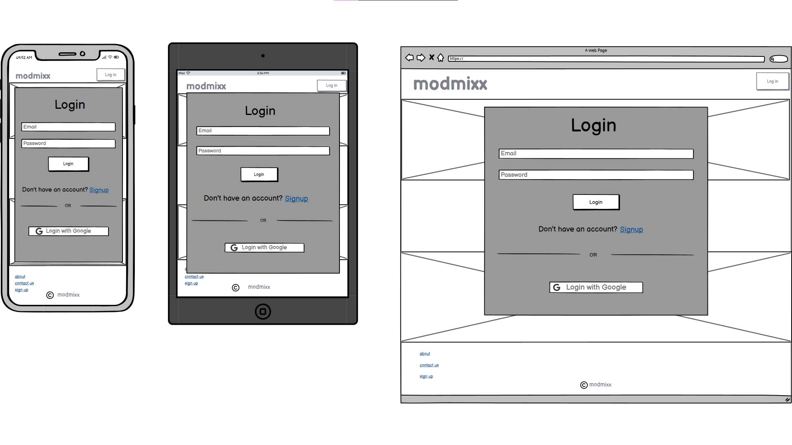

# modmixx

## Planning

### Wireframes

#### Welcome Landing Page

#### Sign Up Page

#### Profile Setup Page

#### Log In Page

#### Main Feed Home Page

#### Individual Post/Track & Comments Page

#### Create Post Form

#### User Profile Page

#### Edit Profile Page

#### About Page

#### Contact Page

#### Error Page

#### Challenges Feed Page

#### Challenge Details Page and Submissions

### Colour Palette

#### Palette Brightness Variations

### Accessibility

#### Contrast 

### Typography

### Site Map

### User Flow Diagrams

#### User Flow for New User Sign Up

#### User Flow for Existing User Posting a Challenge Track

#### User Flow for User Commenting on a Track

#### User Flow for User Editing Their Profile

### ERD 

# Agile Project Management

Agile methodology was used for project management, with a focus on iterative development and reassessment. The project was divided into sprints, each lasting two weeks, allowing for regular reflection and adjustments based on scope and feedback.

### User Personas
Personas were created to represent the target users of the application, helping to guide design and development decisions.

## Themes, Epics, and User Stories
The project was organized into themes, epics, and user stories to ensure a user-centered approach to development. Each theme represents a key area of focus, with epics breaking down larger goals into manageable user stories.

## **Theme 1: Onboarding & Identity**

### **Epic 1.1: Homepage Welcome**

### User Stories:

|Story Number       |  User Story |  Story Point |
|-------|---|---|
|**1.1.1** |  _As a new visitor, I want to see a welcoming message and clear call to action, so that I    understand what the site is for and feel encouraged to join._ |  2 |
|**1.1.2** |  _As a returning user, I want a quick log in option, so that I can easily access my account._ |  2 |

### **Epic 1.2: Navigation**

### User Stories:

|Story Number       |  User Story |  Story Point |
|-------|---|---|
|**1.2.1** |  _As a logged-out user, I want clear links to log in, sign up, and learn more, so that I can easily navigate the site._ |  3 |
|**1.2.2** |  _As a logged-in user, I want navigation to change dynamically, so I can access relevant parts of the site like feed, profile, and challenges._ |  5 |

### **Epic 1.3: User Accounts**

### User Stories:

| Story Number | User Story                                                                                                              | Story Point |
| ------------ | ----------------------------------------------------------------------------------------------------------------------- | ----------- |
| **1.3.1**    | *As a new user, I want to register with a unique username and secure password, so that I can create an account safely.* | 5          |
| **1.3.2**    | *As a returning user, I want to log in with my credentials, so that I can access my profile and uploads.*               | 3           |
| **1.3.3**    | *As a logged-in user, I want to log out securely, so that my session ends safely.*                                      | 2          |

## **Theme 2: Music Sharing & Discovery**

### **Epic 2.1: Track Uploads**

### User Stories:

|Story Number | User Story                                                                                                                                     | Story Point |
| ------------ | ---------------------------------------------------------------------------------------------------------------------------------------------- | ----------- |
| **2.1.1**    | *As a user, I want to upload a music track with a title, DAW used, description, and image, so that others can understand my creative process.* | 8          |
| **2.1.2**    | *As a user, I want to tag my upload with 'feedback wanted' so that others know I am looking for constructive feedback.*                        | 5           |

### **Epic 2.2: Track Feed**

### User Stories:

|Story Number | User Story                                                                                                               | Story Point |
| ------------ | ------------------------------------------------------------------------------------------------------------------------ | ----------- |
| **2.2.1**    | *As a user, I want to scroll through a feed of recent uploads, so that I can discover and listen to other users’ music.* | 5           |
| **2.2.2**    | *As a user, I want to open a track post to see more details and comments, so that I can learn and engage more deeply.*   | 5           |

### **Epic 2.3: Comments**

### User Stories:

| Story Number | User Story                                                                                                  | Story Point |
| ------------ | ----------------------------------------------------------------------------------------------------------- | ----------- |
| **2.3.1**    | *As a user, I want to leave thoughtful comments on tracks, so that I can encourage and engage with others.* | 5           |
| **2.3.2**    | *As a user, I want to edit or delete my own comments, so that I can correct or remove what I wrote.*        | 3           |

## **Theme 3: Belonging & Connection**

### **Epic 3.1: User Profiles**

### User Stories:

| Story Number | User Story                                                                                                      | Story Point |
| ------------ | --------------------------------------------------------------------------------------------------------------- | ----------- |
| **3.1.1**    | *As a user, I want to view and edit my profile (bio, pronouns, image), so that others can understand who I am.* | 5           |
| **3.1.2**    | *As a user, I want to see all my uploaded tracks in one place, so that I can track my creative progress.*       | 3          |

### **Epic 3.2: Monthly Challenges**

### User Stories:

| Story Number | User Story                                                                                                      | Story Point |
| ------------ | --------------------------------------------------------------------------------------------------------------- | ----------- |
| **3.2.1**    | *As a user, I want to view the current monthly challenge, so that I can be inspired and participate.*           | 3           |
| **3.2.2**    | *As a user, I want to see other user submissions for the challenge, so that I feel part of a community effort.* | 2           |
| **3.2.3**    | *As a user, I want to upload my monthly challenge, so that my track is grouped with other submissions.*   | 2           |

## **Theme 4: Trust & Support**

### **Epic 4.1: Static Information Pages**

### User Stories:

| Story Number | User Story                                                                                                   | Story Point |
| ------------ | ------------------------------------------------------------------------------------------------------------ | ----------- |
| **4.1.1**    | *As a visitor, I want to read about the community and its values, so I know if it’s right for me.*           | 1           |
| **4.1.2**    | *As a user, I want clear community guidelines, so that I understand what’s expected and what’s not allowed.* | 2           |
| **4.1.3**    | *As a user, I want to see a helpful 404/504 page if something is missing, so I’m not confused.*              | 1           |

### **Epic 4.2: Contact & Support**

### User Stories:

| Story Number | User Story                                                                                                         | Story Point |
| ------------ | ------------------------------------------------------------------------------------------------------------------ | ----------- |
| **4.2.1**    | *As a visitor or user, I want to contact the site owner for help or feedback, so that I feel heard and supported.* | 3           |
| **4.2.2**    | *As a user, I want to receive a confirmation message when I submit the form, so I know it went through.*           | 2           |

## User Stories for Future Features
### Follow/Friend Users

| User Story                                                                                                              |
| ----------------------------------------------------------------------------------------------------------------------- |
| *As a user, I want to view other users' profile pages, so that I can view their info and listen to their other tracks.* |
| *As a user, I want to follow other users, so that I can easily find people whose work inspires me.*                     |
| *As a user, I want a feed of my followed users, so that I can keep up with their uploads.*                              |

### Messaging & Collaboration

| User Story                                                                                                   |
| ------------------------------------------------------------------------------------------------------------ |
| *As a user, I want to send messages or collaborate with others, so that I can build creative relationships.* |
| *As a user, I want to organize projects with collaborators, so that we can stay on track.*                   |

### Tiered Learning Content

| User Story                                                                                        |
| ------------------------------------------------------------------------------------------------- |
| *As a beginner, I want access to tutorials or 1-to-1 tutorship, so that I can improve my skills.* |
| *As a pro, I want to offer lessons or feedback, so that I can help others and give back.*         |

### Forum & Resources

| User Story                                                                                                     |
| -------------------------------------------------------------------------------------------------------------- |
| *As a user, I want to browse and share production resources, so that I can learn and contribute.*              |
| *As a user, I want a forum space to discuss specific production topics, so that I can find community support.* |

## Like Button (Hidden Count)

| User Story                                                                                           |
| ---------------------------------------------------------------------------------------------------- |
| *As a user, I want to report inappropriate content, so that the community stays safe and welcoming.* |

### Report Button

| User Story                                                                                           |
| ---------------------------------------------------------------------------------------------------- |
| *As a user, I want to report inappropriate content, so that the community stays safe and welcoming.* |

#### Fibonacci Sequence for Estimation
The Fibonacci sequence was used for estimating the complexity of tasks, helping to prioritize features and manage workload effectively. 

#### Fibonacci Effort vs Risk Matrix
