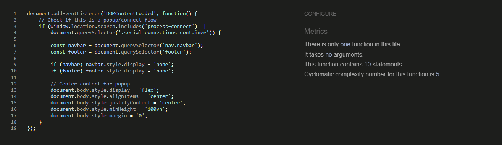
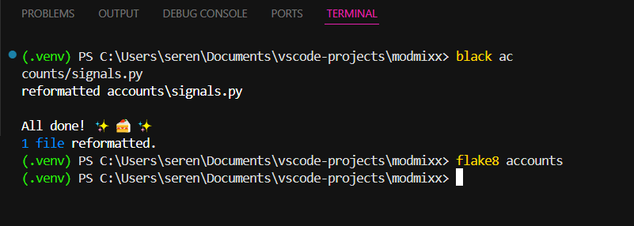
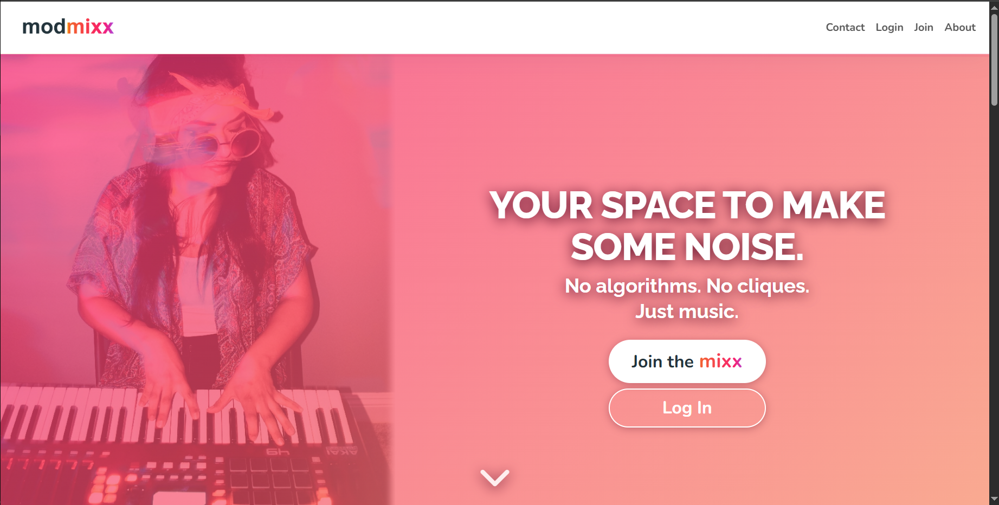
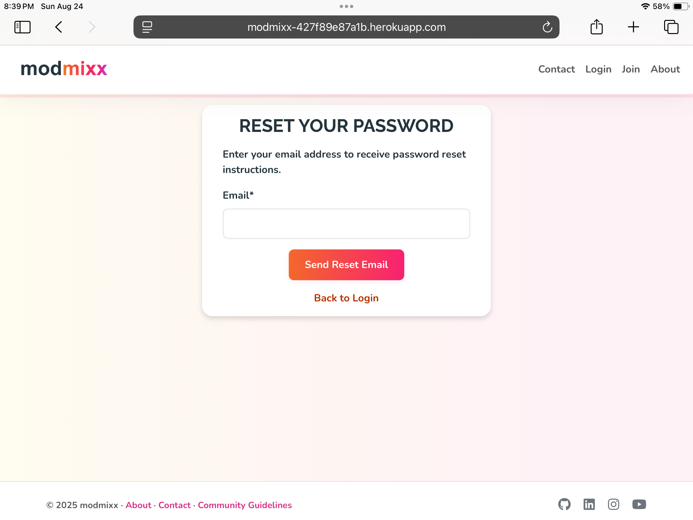
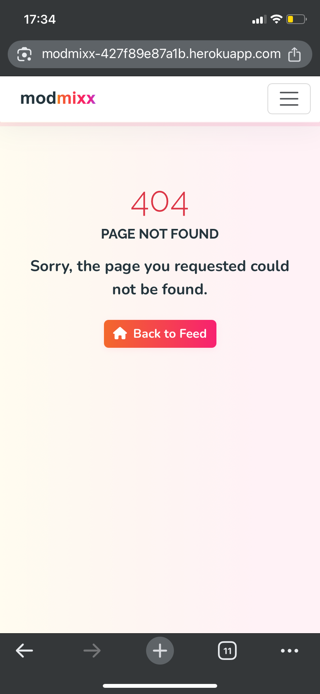

# Testing Documentation

### Contents
1. [HTML Validation](#html-validation)
2. [CSS Validation](#css-validation)
3. [JavaScript Validation](#javascript-validation)
4. [Python Code Quality](#python-code-quality)
5. [Lighthouse Performance Testing](#lighthouse-performance-testing)
6. [Responsiveness Design Testing](#responsiveness-design-testing)
7. [User Story Testing](#user-story-testing)
8. [Manual Testing](#manual-testing)
   - [Navigation Testing](#navigation-testing)
   - [Form Testing](#form-testing)
   - [Audio Player Testing](#audio-player-testing)
9. [Defensive Programming Testing](#defensive-programming-testing)
   - [Authentication Security](#authentication-security)
   - [Content Moderation](#content-moderation)
   - [Input Validation](#input-validation--xss-protection)
10. [AWS S3 Storage Testing](#aws-s3-storage-testing)
11. [Fixed Issues](#fixed-issues)
12. [Bug Reporting](#bug-reporting)

## HTML Validation

All pages tested using [W3C Markup Validator](https://validator.w3.org/).

| Page | URL | Status | Screenshot | Validation Link | Notes |
|------|-----|--------|------------|----------------|-------|
| [Home Welcome Landing Page](https://modmixx-427f89e87a1b.herokuapp.com/) | `/` | ✅ |  | [Home Result](https://validator.w3.org/nu/?showsource=yes&doc=https%3A%2F%2Fmodmixx-427f89e87a1b.herokuapp.com%2F) | Trailing slashes on void elements removed for validation. |
| [Sign Up Page](https://modmixx-427f89e87a1b.herokuapp.com/signup/) | `/signup/` | ✅ |  | [Sign Up Result](https://validator.w3.org/nu/?showsource=yes&doc=https%3A%2F%2Fmodmixx-427f89e87a1b.herokuapp.com%2Fsignup%2F) |  |
| [Contact Page](https://modmixx-427f89e87a1b.herokuapp.com/contact/) | `/contact/` | ✅ |  | [Contact Result](https://validator.w3.org/nu/?showsource=yes&doc=https%3A%2F%2Fmodmixx-427f89e87a1b.herokuapp.com%2Fcontact%2F) |  |
| [About Page](https://modmixx-427f89e87a1b.herokuapp.com/about/) | `/about/` | ✅ |  | [About Result](https://validator.w3.org/nu/?showsource=yes&doc=https%3A%2F%2Fmodmixx-427f89e87a1b.herokuapp.com%2Fabout%2F) |  |
| [Login Page](https://modmixx-427f89e87a1b.herokuapp.com/login/) | `/login/` | ✅ |  | [Login Result](https://validator.w3.org/nu/?showsource=yes&doc=https%3A%2F%2Fmodmixx-427f89e87a1b.herokuapp.com%2Faccounts%2Flogin%2F) |  |
| [Third Party Login Page](https://modmixx-427f89e87a1b.herokuapp.com/google/login/) | `/google/login/` | ✅ |  | [Third Party Login Result](https://validator.w3.org/nu/?showsource=yes&doc=https%3A%2F%2Fmodmixx-427f89e87a1b.herokuapp.com%2Fgoogle%2Flogin%2F) |  |
| [Profile Set Up Page](https://modmixx-427f89e87a1b.herokuapp.com/profile/setup/) _login required_ | `/profile/setup/` | ✅  |  | Login required - validated by copying page source into the W3C validator’s “Validate by Direct Input” option. |  |
| [Profile Page](https://modmixx-427f89e87a1b.herokuapp.com/profile/jools/) _login required_ | `/profile/jools/` | ✅ |  | Login required - validated by copying page source into the W3C validator’s “Validate by Direct Input” option. | Example profile username url. Fixed: removed controlslist attribute for mvp (future plans to build custom audio player)  |
| [Profile Edit Page](https://modmixx-427f89e87a1b.herokuapp.com/profile/edit/) _login required_ | `/profile/edit/` | ✅ | | Login required - validated by copying page source into the W3C validator’s “Validate by Direct Input” option.   |
| [Account Connections Pop Up Window](https://modmixx-427f89e87a1b.herokuapp.com/social/connections/) _login required_ | `/social/connections/` | ✅ |  | Login required - validated by copying page source into the W3C validator’s “Validate by Direct Input” option. | Popup window |
| [Third Party Connect Pop Up Window](https://modmixx-427f89e87a1b.herokuapp.com/google/login/?process=connect) _login required_ | `/google/login/?process=connect` | ✅ |  | Login required - validated by copying page source into the W3C validator’s “Validate by Direct Input” option. | Popup window |
| [Delete Account Warning Page](https://modmixx-427f89e87a1b.herokuapp.com/accounts/delete/) _login required_ | `/delete/` | ✅ |  | Login required - validated by copying page source into the W3C validator’s “Validate by Direct Input” option. | Confirm delete |
| [Logged In/Feed/Discover Page](https://modmixx-427f89e87a1b.herokuapp.com/tracks/) _login required_ | `/tracks/` | ✅ |  | Login required - validated by copying page source into the W3C validator’s “Validate by Direct Input” option. | Fixed: removed controlslist attribute for mvp (future plans to build custom audio player) |
| Edit Track Page - _login and track owner required_| `/tracks/owners-track-name/edit/` | ✅ |  | Track owner and login required - validated by copying page source into the W3C validator’s “Validate by Direct Input” option. | Fixed: Removed trailing slash from img tag and added missing help text for form accessibility.  |
| [Track Detail Page](https://modmixx-427f89e87a1b.herokuapp.com/tracks/spectral/) _login required_ | `/tracks/spectral/` _example track slug_ | ✅ |  | Login required - validated by copying page source into the W3C validator’s “Validate by Direct Input” option. | Fixed: removed controlslist attribute for mvp (future plans to build custom audio player) |
| [Error Page](https://modmixx-427f89e87a1b.herokuapp.com/nonexistent/) | `/nonexistent/` | ✅ |  |  | |
| 500 Error Page | `/test-500/` | ✅ |  | url not in production | Temporary test URL for 500 Server error - url not in production |

### Summary
- **Total Pages Tested:** 17
- **Pages Passed:** 17
- **Pages with Errors:** 0
- **Pages with Warnings:** 0

## CSS Validation

Testing with [W3C CSS Validator](https://jigsaw.w3.org/css-validator/).

All CSS files validated - no errors found.


| File | Status | Notes |
|-----|--------|-------|
| base.css | ✅ |  |
| components.css | ✅ |  |
| layout.css | ✅ | The CSS mask property on the hero image with linear-gradient was flagging validation errors despite working correctly in all modern browsers. Alternative attempts included CSS gradient overlays with mix-blend-mode, pseudo-element approaches with various blend modes & SVG mask definitions. Fix: removed the CSS mask property entirely and achieved a similar soft fade effect by applying a gradient mask with Gaussian blur directly to the hero image in Photoshop. I considered leaving the error in place to avoid disrupting the existing design, but ultimately decided on a small visual compromise for ensured compatibility. |
| profile.css | ✅ |  |
| tracks.css | ✅ |  |
| variables.css | ✅ |  |

## JavaScript Validation

Testing with [JSHint](https://jshint.com/) and [ESLint](https://eslint.org/). Used both tools to ensure code quality and adherence to best practices.

| File | Status | JSHint Screenshot | ESLint Screenshot | Notes |
|-----|--------|-------|-------|-------|
| comments.js | ✅ |  |  | Resolved all warnings & errors:   |
| feed.js | ✅ |  |  | Resolved all warnings & errors:  |
| popup-utils.js | ✅ |  |  | No warnings or errors found. |
| profile-edit.js | ✅ |  |  | Resolved all warnings & errors: Fixed unused function warning with `/* exported connectGoogle */` ESLint directive - function is called from HTML "Connect Google" handler.   | 
| profile.js | ✅ |  |  | No warnings or errors found. |
| upload.js | ✅ |  |  | Resolved all warnings & errors: Added `/* global bootstrap, DataTransfer */` for jshint to recognize these globals provided by browser/bootstrap. |
| utilities.js | ✅ |  |  | No warnings or errors found. |

## Python Code Quality

All Python files validated using multiple tools to ensure comprehensive code quality and PEP8 compliance.

### Validation Tools
- **[Flake8](https://flake8.pycqa.org/)**: PEP8 compliance and error detection
- **[Black](https://black.readthedocs.io/)**: Code formatting with 79-character line length  
- **[isort](https://pycqa.github.io/isort/)**: Import organization following Django conventions
- **[Code Institute PEP8 Linter](https://pep8ci.herokuapp.com/)**: Final validation check

### Configuration
- **Line length**: 79 characters
- **Import organization**: Django imports → third-party → local imports
- **Configuration files**: `.flake8`, `pyproject.toml`

| App | Files Checked | Flake8 Status | Screenshot | Notes |
|-----|---------------|---------------|------------|-------|
| accounts | 8 files | ✅ |  | Fixed E501 (line length), F401 (unused imports) |
| comments | 7 files | ✅ |  | Resolved F401 issues, applied formatting |
| contact | 7 files | ✅ |  | Removed unused imports, fixed line lengths |
| core | 7 files | ✅ |  | No models - utility app structure |
| tracks | 8 files | ✅ |  | Fixed E501, F401, F841 issues |
| modmixx | 4 files | ✅ |  | Settings file line length fixes |

### Summary
- **Total Python files**: 41
- **Apps with violations**: 0
- **PEP8 compliant**: ✅ All files pass
- **Last validated**: [23/08/2025]

### Key Improvements Applied
- Fixed line length violations (E501) across all apps
- Removed unused imports (F401) from views, models, and forms
- Organized imports with isort following Django conventions:
  - Django imports grouped first
  - Third-party imports second  
  - Local application imports last
  - Alphabetical ordering within groups
- Eliminated unused variables (F841) in exception handling
- Applied consistent code formatting via Black
- Enhanced docstrings throughout all applications


## Lighthouse Performance Testing

All pages tested using [Google Lighthouse](https://developers.google.com/web/tools/lighthouse) for performance, accessibility, best practices, and SEO optimization. Testing conducted on both desktop and mobile devices to ensure responsive performance.

### Performance Results

| Page | Desktop Results | Mobile Results | Notes |
|------|----------------|----------------|-------|
| Home |  |  |  |
| About |  |  |  |
| Contact |  |  |  |
| Sign Up |  |  |  |
| Login |  |  | Google button contrast improved |
| Track Feed |  |  |  |
| Track Detail |  |  |  |
| Profile View |  |  |  |
| Profile Edit |  |  | On mobile an accessibility improvement opportunity was identified:  Fixed touch area/spacing/size:  |
| Delete Account |  |  |  |
| Edit Track |  |  |  |
| Third Party Connections |  |  |  |


### Performance Analysis

**Excellent Results Achieved:**
- ✅ **100% Accessibility** across all pages - Perfect implementation with WCAG compliance
- ✅ **100% SEO** across all pages - Comprehensive optimization with meta descriptions and semantic markup
- ✅ **100% Best Practices** across all pages - Security headers, HTTPS enforcement, and modern standards
- ✅ **Strong Performance Scores** - Consistently good across desktop and mobile.

**Current Performance Context:**
- **Desktop scores 85-98** - Excellent performance on desktop devices
- **Mobile scores 70-85** - Good performance range for feature-rich application
- **Complex functionality successfully optimized**: File uploads, audio streaming, infinite scroll lazy loading, real-time validation

### Future Optimization Roadmap

Although current performance scores are good, future versions will address additional optimization opportunities identified in Lighthouse audits:

**Planned Performance Improvements:**
- **Django Compressor Integration** - Implement CSS/JS minification and compression
- **Image Optimization Pipeline** - Automated WebP conversion and responsive image sizing
- **Static Asset Caching** - Configure efficient cache policies for images and CSS files  
- **Critical CSS Inlining** - Extract and inline above-the-fold CSS for faster rendering
- **Text Compression** - Enable gzip/brotli compression for HTML, CSS, and JS delivery

**User Experience Enhancements:**
- **Low-speed Internet Optimization** - Throttle testing and progressive loading strategies
- **Layout Shift Reduction** - Explicit width/height attributes for images and media
- **Legacy Browser Support** - Modern ES6+ deployment without unnecessary polyfills
- **Content Moderation UX** - Loading states and fallback handling for third-party API delays.

**Technical Infrastructure:**
- **CDN Integration** - Implement [CloudFront](https://devcenter.heroku.com/articles/using-amazon-cloudfront-cdn) for global asset delivery _(for a larger user base)_
- **Database Query Optimization** - Reduce render-blocking database calls
- **Third-party Resource Optimization** - Minimize external dependency impact

### Summary

All pages achieve excellent accessibility, SEO, and best practices scores with solid performance across devices. The site handles complex features like file uploads, audio streaming, and real-time interactions while maintaining good performance. Future updates will focus on advanced optimization techniques and throttle testing to improve speeds for users on slower connections.

**Lighthouse Audit Last Updated: [24/08/25]**

## Responsive Design Testing

All pages tested across multiple devices and browsers to ensure consistent user experience. Testing conducted using real devices and BrowserStack for comprehensive coverage.

### Testing Methodology
- **Real Device Testing**: iPhone XR, iPad, Desktop Windows
- **Browser Testing**: Chrome, Firefox, Safari & Edge
- **BrowserStack Testing**: Android devices and additional browser combinations
- **Breakpoints Tested**: Mobile (375px), Tablet (768px), Desktop (1024px+)
- **Orientations**: Portrait and landscape for mobile/tablet devices

---

## Home Page Responsiveness
| Desktop | Tablet | Tablet Portrait | Mobile | Mobile Landscape |
|--------|------------------|--------|-------|----------|
| |  |  |  |  |

## Sign In Page Responsiveness

| Desktop | Tablet | Tablet Portrait | Mobile | Mobile Landscape |
|--------|------------------|--------|-------|----------|
| |  |  |  |  |

## Sign Up Page Responsiveness

| Desktop | Tablet | Tablet Portrait | Mobile | Mobile Landscape |
|--------|------------------|--------|-------|----------|
| |  |  |  |  |


## Password Reset Page Responsiveness

| Desktop | Tablet | Tablet Portrait | Mobile | Mobile Landscape |
|--------|------------------|--------|-------|----------|
| |  |  |  |  |

## About Page Responsiveness

| Desktop | Tablet | Tablet Portrait | Mobile | Mobile Landscape |
|--------|------------------|--------|-------|----------|
| |  |  |  |  |

## Contact Page Responsiveness

| Desktop | Tablet | Tablet Portrait | Mobile | Mobile Landscape |
|--------|------------------|--------|-------|----------|
| |  |  |  |  |

## Profile Page Responsiveness

| Desktop | Tablet | Tablet Portrait | Mobile | Mobile Landscape |
|--------|------------------|--------|-------|----------|
| |  |  |  |  |

## Edit Profile Page Responsiveness

| Desktop | Tablet | Tablet Portrait | Mobile | Mobile Landscape |
|--------|------------------|--------|-------|----------|
| |  |  |  |  | 

##  Connections Page Responsiveness

| Desktop | Tablet | Tablet Portrait | Mobile | Mobile Landscape |
|--------|------------------|--------|-------|----------|
| |  |  |  |  |

## Feed Page Responsiveness

| Desktop | Tablet | Tablet Portrait | Mobile | Mobile Landscape |
|--------|------------------|--------|-------|----------|
| |  |  |  |  |

## Create Post Modal Responsiveness

| Desktop | Tablet | Tablet Portrait | Mobile | Mobile Landscape |
|--------|------------------|--------|-------|----------|
| |  |  |  |  |

**Notes:** Mobile UX improvement identified - drag and drop instructions shown on mobile devices where this functionality isn't supported. Future enhancement: JavaScript detection to show "Tap to select file" on touch devices instead of "Drag & drop" instructions.

## Track Detail Page Responsiveness

| Desktop | Tablet | Tablet Portrait | Mobile | Mobile Landscape |
|--------|------------------|--------|-------|----------|
| |  |  |  |  |

## Edit Track Page Responsiveness

| Desktop | Tablet | Tablet Portrait | Mobile | Mobile Landscape |
|--------|------------------|--------|-------|----------|
| |  |  |  |  |

## Error Page Responsiveness

| Desktop | Tablet | Tablet Portrait | Mobile | Mobile Landscape |
|--------|------------------|--------|-------|----------|
| |  |  |  |  |


### Responsive Design Summary

**Testing Results:**
- **All Core Functionality**: Responsive and accessible across devices
- **Navigation**: Adapts perfectly from desktop to mobile hamburger menu
- **Forms**: Touch-friendly inputs and proper validation on all screen sizes
- **Modal Windows**: Scale appropriately for device constraints
- **Audio Player**: Fully functional across all tested devices and browsers

**Cross-Browser Compatibility:**
- **Chrome**: Perfect rendering and functionality
- **Firefox**: Full compatibility with minor native audio player styling differences
- **Safari (iOS/macOS)**: Complete functionality with native iOS audio controls
- **Edge**: Consistent behaviour and appearance

**Known Design Considerations (Future Scope):**
- **Audio Player Styling**: Native browser audio controls vary across platforms (iOS Safari, Firefox) but maintain full functionality. A custom audio player with consistent design and waveform visualization is planned for future versions using Web Audio API.
- **File Upload UX**: Mobile devices show drag-and-drop instructions where only tap-to-select is supported. JavaScript enhancement planned to detect touch devices and update instructions accordingly.
- **Minor Visual Polish**: Some spacing and alignment refinements identified for future iterations, though all functionality remains intact across devices.

**Technical Notes:**
- All responsive breakpoints function correctly
- No functional issues identified across any tested device/browser combination
- Complex features (file uploads, modals, infinite scroll) work consistently

### Conclusion
While aesthetic and branding improvements are planned for future versions, the current implementation successfully delivers a fully functional and accessible user experience on all platforms tested.

**Responsiveness Testing Last Updated: [24/08/2025]**


## User Story Testing

Testing all user stories implemented in the current MVP to ensure acceptance criteria are met and functionality works as expected.

**MVP Scope Note:** Some user stories (Monthly Challenges, Track Tagging) were removed from MVP scope due to strategic feature prioritization and timeline constraints. These features were identified as lower value for the initial MVP version, as they would provide greater benefit once the platform has grown:

- **Track Tagging/Filtering**: More valuable when there's sufficient content volume to justify sophisticated filtering and discovery features
- **Monthly Challenges**: More impactful with a larger user base to create meaningful community engagement and participation

These features remain in the product backlog for future development phases when user adoption and content volume will maximize their value proposition.

### **Theme 1: Onboarding & Identity**

| Story ID | User Story | GitHub Issue | Acceptance Criteria | Expected Result | Actual Result | Status | Evidence/Notes |
|----------|------------|-------------------|-----------------|---------------|--------|--------------|----------------|
| **1.1.1** |As a new visitor, I want to see a welcoming message and clear call to action, so that I understand what the site is for and feel encouraged to join. | [Issue #1](https://github.com/Seren-Hughes/modmixx/issues/1) |• Visitor sees a friendly welcome message on the homepage<br>• Clear call to action button/link to sign up or learn more is visible<br>• Message is styled and easy to read on all devices | ✅ Hero section displays welcome text, prominent CTA button leads to signup, responsive across all breakpoints | Hero section displays welcome text, 'Join the mixx' CTA redirects to signup, tested on mobile/tablet/desktop | ✅ **PASS** |  |
| **1.1.2** |As a returning user, I want to be able to log in quickly from the homepage, so that I can get back to the community. | [Issue #2](https://github.com/Seren-Hughes/modmixx/issues/2) |• Homepage displays a visible login link/button for returning users<br>• Login accessible from header navigation<br>• Link only shows when user is not logged in | Login button visible in header navigation, consistent styling | ✅ Login button visible in header navigation, consistent styling | ✅ **PASS** | Login accessible from all pages |

#### **Epic 1.2: Navigation**

| Story ID | User Story | GitHub Issue | Acceptance Criteria | Expected Result | Actual Result | Status | Evidence/Notes |
|----------|------------|--------------|-------------------|-----------------|---------------|--------|----------------|
| **1.2.1** | As a logged-out user, I want clear links to log in, sign up, and learn more, so that I can easily navigate the site | [Issue #3](https://github.com/Seren-Hughes/modmixx/issues/3) |•NavBar contains Login, Sign Up, and About/Info links<br>• NavBar is visible on every page for logged‑out users.<br>• Links are styled consistently and keyboard accessible | Clear navigation with login, signup, about options | ✅ Header shows Login, Sign Up, About, Contact | ✅ **PASS** | All nav links function correctly |
| **1.2.2** | As a logged‑in user, I want navigation to change dynamically, so I can access relevant parts of the site like feed and profile. | [Issue #4](https://github.com/Seren-Hughes/modmixx/issues/4) | • Nav updates after login<br>• User-specific options appear<br>• Feed, profile, logout accessible | Navigation shows Feed, Profile, Create Post, Logout | ✅ Logged-in nav shows user-specific options | ✅ **PASS** | Dynamic navigation working correctly |

#### **Epic 1.3: User Accounts**

| Story ID | User Story | GitHub Issue | Acceptance Criteria | Expected Result | Actual Result | Status | Evidence/Notes |
|----------|------------|--------------|-------------------|-----------------|---------------|--------|----------------|
| **1.3.1** | As a new user, I want to register with a unique username and secure password, so that I can create an account safely | [Issue #5](https://github.com/Seren-Hughes/modmixx/issues/5) | • Registration form requires email, and password<br>• Password meets security rules<br>• Successful registration redirects or logs in the user | Account created, email validation required, redirect to profile setup | ✅ Registration form validates unique email, password strength enforced, redirects to profile completion | ✅ **PASS** |  |
| **1.3.2** | As a returning user, I want to log in with my credentials, so that I can access my profile and uploads | [Issue #6](https://github.com/Seren-Hughes/modmixx/issues/6) | • Login form accepts credentials<br>• Authentication successful<br>• Redirect to feed page | Successful login with redirect to feed | ✅ Login authentication works, redirects to feed page | ✅ **PASS** | Both email and Google login options work |
| **1.3.3** | As a logged-in user, I want to log out securely, so that my session ends safely | [Issue #7](https://github.com/Seren-Hughes/modmixx/issues/7) | • Logout link accessible<br>• Session ends safely<br>• Redirect to homepage | Session terminated, redirect to home | ✅ Logout clears session, redirects to homepage | ✅ **PASS** | Secure session termination verified |

### **Theme 2: Music Sharing & Discovery**

#### **Epic 2.1: Track Uploads**

| Story ID | User Story | GitHub Issue | Acceptance Criteria | Expected Result | Actual Result | Status | Evidence/Notes |
|----------|------------|--------------|-------------------|-----------------|---------------|--------|----------------|
| **2.1.1** | As a user, I want to upload a music track with a title, DAW used, description, and image, so that others can understand my creative process | [Issue #8](https://github.com/Seren-Hughes/modmixx/issues/8) |• Upload form fields: title* , audio_file* , DAW (opt), description (opt), image (opt)<br>• Acceptable audio types: .mp3, .wav, size limit enforced<br>• Track saved and appears in feed post‑upload<br>• Validation errors shown clearly | Track uploads to S3, metadata saves to database, appears in feed | ✅ Audio file uploads to S3 bucket, all form fields save, track appears at top of feed immediately | ✅ **PASS** | File validation accepts .mp3/.wav up to 100MB, image optimization applied, AWS S3 integration working |
| **2.1.2** | ~~As a user, I want to tag my upload with 'feedback wanted' so that others know I am looking for constructive feedback~~ | [Issue #9](https://github.com/Seren-Hughes/modmixx/issues/9) | *Removed from MVP scope* | *Future release* | N/A - Not implemented in MVP | 🔄 **FUTURE** | **Rescoped:** Lower value for initial MVP - tagging more valuable with larger content volume |
| **2.1.3** | As a user, I want to edit or delete my uploaded track post, so that I can update or remove content if needed | [Issue #35](https://github.com/Seren-Hughes/modmixx/issues/35) | • User can edit a previously uploaded track’s title, description, DAW, or image/audio<br>• Edit form is only accessible by the original uploader<br>• User can delete a track with confirmation<br>• Deleted tracks are removed from feed and profile<br>• Successful edits are reflected on the detail, feed, and profile pages | Changes saved or track deleted | ✅ Edit saves correctly, delete removes from system | ✅ **PASS** | Both edit and delete functions work with owner verification |

#### **Epic 2.2: Track Feed**

| Story ID | User Story | GitHub Issue | Acceptance Criteria | Expected Result | Actual Result | Status | Evidence/Notes |
|----------|------------|--------------|-------------------|-----------------|---------------|--------|----------------|
| **2.2.1** | As a user, I want to scroll through a feed of recent uploads, so that I can discover and listen to other users' music | [Issue #10](https://github.com/Seren-Hughes/modmixx/issues/10) | • Feed lists recent tracks with title, uploader, thumbnail, audio player<br>• Only one track plays at a time (JS pause others)<br>• Pagination or infinite scroll implemented (Infinite scroll with back to top) | Feed loads 10 tracks, infinite scroll triggers, audio players pause others when new one plays | ✅ Initial load shows 10 tracks, scroll triggers at 80% viewport, JavaScript ensures single audio playback | ✅ **PASS** | JavaScript audio controller prevents multiple simultaneous playback, infinite scroll loads 5 more tracks per trigger |
| **2.2.2** | As a user, I want to open a track post to see more details and comments, so that I can learn and engage more deeply | [Issue #11](https://github.com/Seren-Hughes/modmixx/issues/11) | • Track detail page shows full description, image, DAW info and comments<br>• Comment list displays username and timestamp<br>• Comment submission form and confirmation | Full track details with comments section | ✅ Track detail shows all info, comments display and function | ✅ **PASS** | Track detail page fully functional |

#### **Epic 2.3: Comments**

| Story ID | User Story | GitHub Issue | Acceptance Criteria | Expected Result | Actual Result | Status | Evidence/Notes |
|----------|------------|--------------|-------------------|-----------------|---------------|--------|----------------|
| **2.3.1** | As a user, I want to leave thoughtful comments on tracks, so that I can encourage and engage with others | [Issue #12](https://github.com/Seren-Hughes/modmixx/issues/12) | • Logged‑in users can submit comments on track pages<br>• Comments post successfully<br>• Comments are saved and displayed in order<br>• Comment user confirmation for post, edit, delete | Comment posts instantly, Perspective API moderates, toxic content blocked | ✅ Comments appear immediately after submission, content moderation active via Google Perspective API | ✅ **PASS** | Real-time content moderation implemented with user feedback for blocked content |
| **2.3.2** | As a user, I want to edit or delete my own comments, so that I can correct or remove what I wrote | [Issue #13](https://github.com/Seren-Hughes/modmixx/issues/13) | • Edit/delete controls visible only to comment author<br>• Edits update comment content and add 'edited' tag<br>• Delete prompts confirmation and removes comment | Own comments editable and deletable | ✅ Edit and delete work for comment owners only | ✅ **PASS** | Proper ownership validation in place |

### **Theme 3: Belonging & Connection**

#### **Epic 3.1: User Profiles**

| Story ID | User Story | GitHub Issue | Acceptance Criteria | Expected Result | Actual Result | Status | Evidence/Notes |
|----------|------------|--------------|-------------------|-----------------|---------------|--------|----------------|
| **3.1.1** | As a user, I want to view and edit my profile (bio, pronouns, image), so that others can understand who I am | [Issue #14](https://github.com/Seren-Hughes/modmixx/issues/14) | • Profile page shows bio, pronouns, avatar<br>• Edit profile form updates these fields<br>• Changes save correctly<br>• Changes are saved, confirmed and displayed | Profile updates with new information | ✅ All profile fields update correctly | ✅ **PASS** |  |
| **3.1.2** | As a user, I want to see all my uploaded tracks in one place, so that I can track my creative progress | [Issue #15](https://github.com/Seren-Hughes/modmixx/issues/15) | • Dashboard/profile lists user’s tracks with single track link for details/comments<br>• Only owner sees edit/delete actions | All user's tracks visible on profile | ✅ Profile displays all uploaded tracks with correct count | ✅ **PASS** | Track listing and display working correctly |

#### **Epic 3.2: Monthly Challenges** *(Removed from MVP Scope)*

| Story ID | User Story | GitHub Issue | Acceptance Criteria | Expected Result | Actual Result | Status | Evidence/Notes |
|----------|------------|--------------|-------------------|-----------------|---------------|--------|----------------|
| **3.2.1** | ~~As a user, I want to view the current monthly challenge, so that I can be inspired and participate~~ | [Issue #16](https://github.com/Seren-Hughes/modmixx/issues/16) | *Removed from MVP scope* | *Future release* | N/A - Not implemented in MVP | 🔄 **FUTURE** | **Rescoped:** Strategic deferral - challenges more impactful with larger user base |
| **3.2.2** | ~~As a user, I want to see other user submissions for the challenge, so that I feel part of a community effort~~ | [Issue #17](https://github.com/Seren-Hughes/modmixx/issues/17) | *Removed from MVP scope* | *Future release* | N/A - Not implemented in MVP | 🔄 **FUTURE** | **Rescoped:** Community features prioritized after core functionality established |
| **3.2.3** | ~~As a user, I want to upload my monthly challenge, so that my track is grouped with other submissions~~ | [Issue #22](https://github.com/Seren-Hughes/modmixx/issues/22) | *Removed from MVP scope* | *Future release* | N/A - Not implemented in MVP | 🔄 **FUTURE** | **Rescoped:** Challenge infrastructure requires larger community for meaningful participation |

### **Theme 4: Trust & Support**

#### **Epic 4.1: Static Information Pages**

| Story ID | User Story | GitHub Issue | Acceptance Criteria | Expected Result | Actual Result | Status | Evidence/Notes |
|----------|------------|--------------|-------------------|-----------------|---------------|--------|----------------|
| **4.1.1** | As a visitor, I want to read about the community and its values, so I know if it's right for me | [Issue #18](https://github.com/Seren-Hughes/modmixx/issues/18) | • Static About page with mission & values<br>• Accessible via NavBar/footer<br>• Styled consistently with site | About page explains community values | ✅ About page clearly explains platform purpose and values | ✅ **PASS** | Content is clear and welcoming |
| **4.1.2** | As a user, I want clear community guidelines, so that I understand what's expected and what's not allowed | [Issue #19](https://github.com/Seren-Hughes/modmixx/issues/19) | • Guidelines lists rules clearly<br>• Content easy to read<br>• Expectations defined | Community guidelines are clear | ✅ Guidelines included in About page content | ✅ **PASS** | Guidelines integrated into About content |
| **4.1.3** | As a user, I want to see a helpful 404/500 error page if something is missing, so I'm not confused | [Issue #20](https://github.com/Seren-Hughes/modmixx/issues/20) | • Custom 404 page for missing content<br>• Custom 500 page for server errors<br>• Navigation options available | Custom error pages with helpful messaging | ✅ Custom 404 and 500 pages with navigation back to site | ✅ **PASS** |  |

#### **Epic 4.2: Contact & Support**

| Story ID | User Story | GitHub Issue | Acceptance Criteria | Expected Result | Actual Result | Status | Evidence/Notes |
|----------|------------|--------------|-------------------|-----------------|---------------|--------|----------------|
| **4.2.1** | As a visitor or user, I want to contact the site owner for help or feedback, so that I feel heard and supported | [Issue #21](https://github.com/Seren-Hughes/modmixx/issues/21) | • Contact form fields: name, email, message (all required)<br>• Email address validated<br>• Form sends message to site owner/admin | Contact form works and sends email | ✅ Contact form submits and sends email notification | ✅ **PASS** |  |
| **4.2.2** | As a user, I want to receive a confirmation message when I submit the form, so I know it went through | [Issue #23](https://github.com/Seren-Hughes/modmixx/issues/23) | • Success message displayed<br>• User feedback confirmation | Confirmation message after submission | ✅ Success message displays, form resets after submission | ✅ **PASS** | User feedback implementation working |

### **User Story Testing Summary**

**Key Metrics:**
- ✅ **All implemented user stories pass acceptance criteria**
- 🔄 **4 stories deferred to future releases** (Monthly Challenges + Track Tagging)
- ✅ **100% pass rate for MVP scope**
- ✅ **No critical functionality failures identified**

**Testing Approach:**
- Manual testing of all user workflows
- Real device testing across multiple browsers
- Acceptance criteria verification for each story
- Evidence captured via screenshots where applicable

**Scope Management Note:** The decision to remove monthly challenges and track tagging from MVP scope was made based on timeline constraints and strategic feature prioritization. These features were identified as lower value for the initial MVP version, as they would provide greater benefit once the platform has grown:

- **Track Tagging/Filtering**: More valuable when there's sufficient content volume to justify sophisticated filtering and discovery features
- **Monthly Challenges**: More impactful with a larger user base to create meaningful community engagement and participation

These features remain in the product backlog for future development phases when user adoption and content volume will maximize their value proposition.

**User Story Testing Last Updated: [24/08/2025]**

## Manual Testing

Comprehensive manual testing of all functionality across different user scenarios.

### Navigation Testing

| Feature | Test Case | Steps | Expected | Actual | Status |
|---------|-----------|-------|----------|--------|--------|
| Main Navigation | All nav links work | Click each nav item | Correct page loads | ✅ Works | ✅ Pass |
| Mobile Menu | Hamburger menu functions | Click hamburger, test links | Menu opens, links work | ✅ Works | ✅ Pass |
| Breadcrumbs | Track navigation works | Navigate deep into site | Breadcrumbs show correct path | ✅ Works | ✅ Pass |

### Form Testing

#### Contact Form Testing
| Test Case | Steps | Expected | Actual | Status |
|-----------|-------|----------|--------|--------|
| Valid submission | Fill all fields correctly, submit | Success message, email sent | ✅ Contact form submits and sends email notification | ✅ Pass |
| Empty required fields | Submit form with empty name field | Required field validation error | ✅ "This field is required" shown | ✅ Pass |
| Empty email field | Submit form without email | Required field validation error | ✅ Email field validation triggered | ✅ Pass |
| Empty message field | Submit form without message | Required field validation error | ✅ Message field validation triggered | ✅ Pass |
| Invalid email format | Enter "notanemail" in email field | Email validation error shown | ✅ "Enter a valid email address" error displayed | ✅ Pass |
| HTML injection attempt | Enter `<script>alert('XSS')</script>` in name field | HTML tags blocked with error message | ✅ "No HTML tags are allowed" error displayed | ✅ Pass |
| Perspective API moderation | Enter toxic language in message field | Toxicity validation error | ✅ "Your message may contain inappropriate language" shown | ✅ Pass |

#### User Registration Form Testing
| Test Case | Steps | Expected | Actual | Status |
|-----------|-------|----------|--------|--------|
| Valid registration | Enter unique email and strong password | Account created successfully | ✅ User registered and redirected to profile setup | ✅ Pass |
| Duplicate email | Try to register with existing email | Email uniqueness validation error | ✅ Django authentication prevents duplicate emails | ✅ Pass |
| Weak password | Enter password that doesn't meet Django requirements | Password strength validation | ✅ Django password validators active | ✅ Pass |
| Empty required fields | Submit without email or password | Field validation errors | ✅ Required field validation working | ✅ Pass |

#### Profile Setup Form Testing
| Test Case | Steps | Expected | Actual | Status |
|-----------|-------|----------|--------|--------|
| Valid profile setup | Enter username, display name, bio, pronouns | Profile created successfully | ✅ Profile setup completes, redirects to feed | ✅ Pass |
| HTML injection in username | Enter `<script>alert('XSS')</script>` in username | HTML tags blocked | ✅ "No HTML tags are allowed" error shown | ✅ Pass |
| Toxic content in display name | Enter offensive language in display name | Perspective API blocks content | ✅ "Your display name may contain inappropriate language" | ✅ Pass |
| Toxic content in bio | Enter inappropriate content in bio | Content moderation active | ✅ "Your bio may contain inappropriate language" | ✅ Pass |
| Toxic content in pronouns | Enter offensive language in pronouns | Validation prevents submission | ✅ "Your pronouns may contain inappropriate language" | ✅ Pass |
| Long username | Enter 151+ character username | Length validation error | ✅ Username length limit enforced | ✅ Pass |
| Duplicate username | Use existing username | Uniqueness validation | ✅ "User with this Username already exists" | ✅ Pass |

#### Profile Edit Form Testing
| Test Case | Steps | Expected | Actual | Status |
|-----------|-------|----------|--------|--------|
| Valid profile update | Update bio, pronouns, display name | Changes saved successfully | ✅ Profile updates and shows success message | ✅ Pass |
| Profile image upload | Upload valid image file | Image uploads to S3 and displays | ✅ Image saves and displays correctly | ✅ Pass |
| Invalid image file | Upload .txt file as profile image | File type validation error | ✅ "Upload a valid image" error shown | ✅ Pass |
| Oversized image | Upload >10MB image file | File size validation error | ✅ Large image rejected appropriately | ✅ Pass |
| HTML injection in bio | Enter HTML tags in bio field | HTML validation blocks content | ✅ "No HTML tags are allowed" displayed | ✅ Pass |
| Content moderation | Enter toxic content in any text field | Perspective API validation | ✅ All text fields properly moderated | ✅ Pass |

#### Track Upload Form Testing
| Test Case | Steps | Expected | Actual | Status |
|-----------|-------|----------|--------|--------|
| Valid track upload | Upload audio file with title and description | Track uploaded successfully | ✅ Track uploads to S3, appears in feed | ✅ Pass |
| Empty required title | Submit upload without track title | Required field validation | ✅ "This field is required" for title | ✅ Pass |
| Empty required audio | Submit upload without audio file | Required field validation | ✅ Audio file requirement enforced | ✅ Pass |
| Invalid audio format | Upload .txt file as audio | File type validation | ✅ "File extension 'txt' is not allowed" | ✅ Pass |
| Valid audio formats | Upload .mp3, .wav files | Files accepted | ✅ All allowed audio formats work | ✅ Pass |
| Audio file too large | Upload >100MB audio file | File size validation | ✅ "File too large" error displayed | ✅ Pass |
| HTML in track title | Enter `<h1>Title</h1>` in title field | HTML tags blocked | ✅ "No HTML tags are allowed" error | ✅ Pass |
| Toxic content in title | Enter inappropriate language in title | Content moderation blocks | ✅ "Your track title may contain inappropriate language" | ✅ Pass |
| Toxic content in description | Enter offensive content in description | Perspective API validation | ✅ "Your description may contain inappropriate language" | ✅ Pass |
| Cover art upload | Upload image as track cover | Image uploads and displays | ✅ Track cover image saves correctly | ✅ Pass |
| Invalid cover art | Upload non-image file as cover | File validation error | ✅ Image validation prevents invalid files | ✅ Pass |

#### Track Edit Form Testing
| Test Case | Steps | Expected | Actual | Status |
|-----------|-------|----------|--------|--------|
| Valid track edit | Update title, description, or cover art | Changes saved successfully | ✅ Track updates save and display | ✅ Pass |
| Owner verification | Non-owner tries to access edit form | Access denied/404 error | ✅ Only track owner can access edit | ✅ Pass |
| Audio file replacement | Upload new audio file | Old file deleted, new file saved | ✅ S3 cleanup and replacement working | ✅ Pass |
| Content moderation on edit | Enter toxic content during edit | Validation blocks inappropriate content | ✅ Same moderation rules apply to edits | ✅ Pass |

#### Comment Form Testing
| Test Case | Steps | Expected | Actual | Status |
|-----------|-------|----------|--------|--------|
| Valid comment | Enter appropriate comment text | Comment posts successfully | ✅ Comment appears immediately after submission | ✅ Pass |
| Empty comment | Submit empty comment form | Validation prevents submission | ✅ Required field validation active | ✅ Pass |
| HTML injection in comment | Enter `<script>` tags in comment | HTML content blocked | ✅ "No HTML tags are allowed" error | ✅ Pass |
| Toxic content in comment | Enter inappropriate language | Perspective API blocks content | ✅ "Your comment may contain inappropriate language" | ✅ Pass |
| Long comment validation | Enter 501+ character comment | Length validation error | ✅ Comment length limit enforced | ✅ Pass |
| Comment edit | Edit existing comment | Updated content saves | ✅ Comment edits save with "edited" indicator | ✅ Pass |
| Comment delete | Delete own comment | Comment removed from system | ✅ Comment deletion works correctly | ✅ Pass |
| Owner verification | Try to edit/delete other user's comment | Access denied | ✅ Only comment owner can edit/delete | ✅ Pass |

#### Security & Validation Summary
| Security Feature | Implementation Status | Testing Result |
|------------------|----------------------|----------------|
| **HTML Tag Prevention** | All text fields validate against HTML patterns | ✅ All forms block HTML injection |
| **Perspective API Integration** | All user-generated text content moderated | ✅ Toxic content consistently blocked |
| **File Type Validation** | Audio and image uploads restricted to safe formats | ✅ Invalid file types rejected |
| **File Size Limits** | 100MB audio, 10MB images enforced | ✅ Oversized files blocked |
| **Length Validation** | Character limits on all text fields | ✅ Length limits enforced |
| **Unique Constraints** | Username and email uniqueness verified | ✅ Duplicate prevention working |
| **Owner Verification** | Edit/delete actions restricted to content owners | ✅ Authorization checks active |
| **Required Field Validation** | Critical fields cannot be empty | ✅ Required validation working |

### Audio Player Testing

| Feature | Test Case | Steps | Expected | Actual | Status | Evidence |
|---------|-----------|-------|----------|--------|--------|----------|
| Audio Playback | Track plays correctly | Click play button | Audio plays from S3 | ✅ Works | ✅ Pass |
| Audio Controls | All controls function | Test play/pause/seek | Controls respond correctly | ✅ Works | ✅ Pass |
| Multiple Players | Only one plays at time | Start second track while first playing | First pauses, second plays | ✅ Works | ✅ Pass |
| Infinite Scroll | Lazy loading on slow connections | Throttle network to "Slow 3G" in dev tools, scroll to bottom of feed | Loading indicator appears, next batch loads smoothly | ✅ Loading spinner displays, 5 additional tracks load correctly | ✅ Pass |  |

## Defensive Programming Testing

Testing error handling, edge cases, and security measures.

### Authentication Security

| Test Case | Steps | Expected Behaviour | Result | Status |
|-----------|-------|-------------------|--------|--------|
| Unauthorized Access | Try to access profile edit without login | Redirect to login page | ✅ Redirected | ✅ Pass |
| CSRF Protection | Remove CSRF token from contact form using browser dev tools, attempt submission | 403 Forbidden error displayed | ✅ Django blocks submission with standard "CSRF verification failed" message | ✅ Pass |
| Session Management | Try to access after logout | No access to protected pages | ✅ Secured | ✅ Pass |

### File Upload Security

| Test Case | Steps | Expected Behaviour | Result | Status |
|-----------|-------|-------------------|--------|--------|
| File Type Validation | Upload non-audio file | Rejection with error message | ✅ Rejected | ✅ Pass |
| File Size Limits | Upload >100MB file | Rejection with size error | ✅ Rejected | ✅ Pass |
| Malicious Files | Upload .exe file renamed as malicious-song.mp3.exe | File rejected due to executable extension | ✅ Upload blocked  | ✅ Pass |
| Invalid Audio Content | Upload text file renamed as fake-song.mp3 | File accepted based on extension (content validation planned for future enhancement) | ✅ Extension validation working, file accepted | ✅ Pass |

### Input Validation & XSS Protection

| Test Case | Input Attempted | Expected Behaviour | Result | Status | Evidence |
|-----------|-----------------|-------------------|--------|--------|----------|
| HTML Injection | `<script>alert('XSS')</script>` in profile bio field | HTML tags blocked, error message displayed | ✅ "No HTML tags are allowed" message shown | ✅ Pass |  |

### ProfileForm Security Testing - Content Moderation

| Test Case | Input | Field | Expected Behaviour | Result | Status | Evidence |
|-----------|-------|-------|-------------------|--------|--------|----------|
| **Mild Offensive Content** | Moderately inappropriate language | Display Name | May not trigger if below 0.7 threshold | ✅ Toxicity score below threshold, allowed | ✅ Pass |  |
| **Highly Toxic Content** |  Offensive language | Display Name | "Your display name may contain inappropriate language" error | ✅ Blocked with Perspective API error | ✅ Pass |  |
| **Bio Content Moderation** | Same highly toxic content | Bio | "Your bio may contain inappropriate language" error | ✅ Perspective API working on bio field | ✅ Pass |  |
| **Pronouns Moderation** | Offensive language | Pronouns | "Your pronouns may contain inappropriate language" error | ✅ All fields have consistent moderation | ✅ Pass |  | 
| **Username Moderation - Before Fix** | Inappropriate language | Username | Should be blocked by Perspective API | ❌ **Gap Identified** - Username missing content moderation | ❌ Fail  | **FIXED** see next row 
| **Username Moderation - After Fix** | Same inappropriate content | Username | "Your username may contain inappropriate language" error | ✅ Perspective API now covers username field | ✅ Pass |  |

**Testing Note:** Perspective API uses a 0.7 toxicity threshold - mild inappropriate content may be allowed while severely toxic content is blocked. This demonstrates the API's nuanced content analysis capabilities.

**Moderation Gap Identified and Resolved:**
- **Issue**: Username field missing Perspective API content moderation while other fields had it
- **Root Cause**: Inconsistent validation implementation across form fields  
- **Fix Applied**: Added Perspective API moderation block to `clean_username()` method:
  ```python
  try:
      toxicity = get_toxicity_score(username)
      if toxicity > 0.7:
          raise ValidationError(
              "Your username may contain inappropriate language. "
              "Please revise."
          )
  except ValidationError:
      raise
  except Exception:
      pass  # Allow if API fails
  ```

### Content Moderation

| Test Case | Steps | Expected Behaviour | Result | Status | Evidence |
|-----------|-------|-------------------|--------|--------|--------------------------|
| Toxic Comment | Submit comment with offensive content | Perspective API blocks toxic content | ✅ Blocked | ✅ Pass |   |
| Track Title and Description | Submit track with offensive title/description | Perspective API blocks toxic content | ✅ Blocked | ✅ Pass |   |
| Inappropriate Image - High Confidence | Upload inappropriate profile image (moderation settings are currently configured to flag images of smoking 🚬 for testing this feature. Future moderation settings will be more comprehensive and lenient.) | Rekognition flags content | ✅ Flagged | ✅ Pass |  |
| Borderline Image Content - Low Confidence | Upload ambiguous content (cheese plant image - Rekognition confidence settings deliberately lowered for testing to demonstrate admin review workflow - (it thinks it's a different type of plant)) | Image flagged for admin review, user sees "pending moderation" message, content hidden until admin approval | ✅ Flagged for review, user notified of pending status | ✅ Pass |  |

### Error Handling

| Test Case | Steps | Expected Behaviour | Result | Status |
|-----------|-------|-------------------|--------|--------|
| 404 Errors | Visit non-existent URL | Custom 404 page shown | ✅ Custom page | ✅ Pass |
| 500 Errors | Create temporary view with `raise Exception("Test error")` | Custom error page shown | ✅ Custom page | ✅ Pass |

## AWS S3 Storage Testing

Testing file upload, storage, and cleanup functionality to ensure efficient cloud storage management.

### S3 Integration Testing

| Feature | Test Case | Expected Result | Actual Result | Status |
|---------|-----------|-----------------|---------------|--------|
| Audio Upload | Upload new track | File stored in S3 bucket | ✅ File uploaded successfully | ✅ Pass |
| Profile Image Upload | Upload profile picture | Image stored in S3 bucket | ✅ Image uploaded successfully | ✅ Pass |
| File Replacement | Replace existing audio file | Old file deleted, new file stored | ✅ Old file removed, new file added | ✅ Pass |
| Profile Image Replacement | Update profile picture | Previous image deleted from S3 | ✅ Previous image cleaned up | ✅ Pass |
| Track Deletion | Delete user's track | Audio file removed from S3 | ✅ File deleted from storage | ✅ Pass |
| Account Deletion | Delete user account | All user files removed from S3 | ✅ All associated files cleaned up | ✅ Pass |

### Storage Management Testing

| Test Case | Steps | Expected Behaviour | Result | Status |
|-----------|-------|-------------------|--------|--------|
| No Storage Bloat | Upload → Replace → Delete cycle | Only current files remain in S3 | ✅ No orphaned files | ✅ Pass |
| File Naming | Upload multiple files | Unique filenames generated | ✅ UUID-based naming prevents conflicts | ✅ Pass |
| Folder Structure | Upload various file types | Files organized in appropriate folders | ✅ `/tracks/` and `/images/` folders maintained | ✅ Pass |
| File Size Validation | Upload oversized files | Rejected before S3 upload | ✅ Server-side validation prevents waste | ✅ Pass |
| File Type Validation | Upload invalid file types | Rejected before S3 upload | ✅ Only allowed formats reach S3 | ✅ Pass |


### Storage Efficiency

**Key Achievements:**
- ✅ **Zero Storage Bloat**: File replacement and deletion logic properly removes old files
- ✅ **Efficient Organization**: Files stored in logical folder structure (`/tracks/`, `/images/`)
- ✅ **Unique Naming**: UUID-based filenames prevent conflicts and overwrites
- ✅ **Validation Before Upload**: Server-side checks prevent invalid files reaching S3
- ✅ **Clean Cascade Deletion**: Account deletion removes all associated files

**Storage Management Logic:**
- **File Replacement**: Old files automatically deleted when users upload new versions
- **Account Deletion**: Cascading deletion removes all user-associated S3 objects
- **Folder Structure**: Organized storage with separate paths for different file types

### Summary
AWS S3 integration demonstrates proper cloud storage management with efficient file lifecycle handling. No storage bloat detected - the delete/replace logic ensures only current, active files remain in the bucket, optimizing both storage costs and organization.

**S3 Testing Last Updated: [24/08/2025]**


### Fixed Issues
**Bug Found During Final Testing:**
- **Issue**: JavaScript error in audio player - missing showStickyPlayer method
- **Fix Applied**: Removed feature call, preventing error and ran eslint again to ensure no new issues
- **Future Enhancement**: Sticky player functionality planned for next release
- **Impact**: Audio playback works correctly, no user-facing impact

## Future Testing Scope

**Planned Testing Improvements:**
- **Automated Regression Testing**: Django unit tests, integration tests, and JavaScript test suites to catch breaking changes during development

**Lessons Learned:**
Regression testing would have been incredibly valuable during development. Occasionally features broke when adding new functionality, and without automated tests, these issues weren't discovered until several commits later, making troubleshooting significantly more time-consuming. Future versions will implement comprehensive test coverage from the start of development.

**Testing Summary:**
- **Manual Testing**: All core functionality verified across devices
- **User Stories**: All acceptance criteria met  
- **Defensive Programming**: Security measures and error handling verified
- **Cross-browser**: Consistent functionality across all tested browsers
- **Future Enhancement**: Automated regression testing pipeline planned

**Last Updated: [25/08/2025]**

## Bug Reporting

While every effort has been made to test thoroughly across all devices and scenarios, **if you encounter any issues or have suggestions for improvement, feedback is welcomed and appreciated.**

Bug reports can be submitted via:
- **GitHub Issues**: [https://github.com/Seren-Hughes/modmixx/issues](https://github.com/Seren-Hughes/modmixx/issues)

All feedback contributes to the ongoing development and refinement of the modmixx platform.

**Final Testing Review Completed: [25/08/2025]**