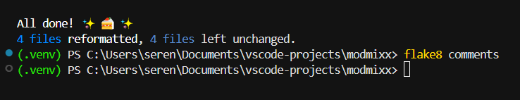

# Testing Documentation

### Contents
1. [HTML Validation](#html-validation)
2. [CSS Validation](#css-validation)
3. [JavaScript Validation](#javascript-validation)
4. [Python Code Quality](#python-code-quality)
5. [Lighthouse Performance Testing](#lighthouse-performance-testing)

## HTML Validation

All pages tested using [W3C Markup Validator](https://validator.w3.org/).

| Page | URL | Status | Screenshot | Validation Link | Notes |
|------|-----|--------|------------|----------------|-------|
| [Home Welcome Landing Page](https://modmixx-427f89e87a1b.herokuapp.com/) | `/` | ✅ |  | [Home Result](https://validator.w3.org/nu/?showsource=yes&doc=https%3A%2F%2Fmodmixx-427f89e87a1b.herokuapp.com%2F) | Trailing slashes on void elements removed for validation. |
| [Sign Up Page](https://modmixx-427f89e87a1b.herokuapp.com/signup/) | `/signup/` | ✅ |  | [Sign Up Result](https://validator.w3.org/nu/?showsource=yes&doc=https%3A%2F%2Fmodmixx-427f89e87a1b.herokuapp.com%2Fsignup%2F) |  |
| [Contact Page](https://modmixx-427f89e87a1b.herokuapp.com/contact/) | `/contact/` | ✅ |  | [Contact Result](https://validator.w3.org/nu/?showsource=yes&doc=https%3A%2F%2Fmodmixx-427f89e87a1b.herokuapp.com%2Fcontact%2F) |  |
| [About Page](https://modmixx-427f89e87a1b.herokuapp.com/about/) | `/about/` | ✅ |  | [About Result](https://validator.w3.org/nu/?showsource=yes&doc=https%3A%2F%2Fmodmixx-427f89e87a1b.herokuapp.com%2Fabout%2F) |  |
| [Login Page](https://modmixx-427f89e87a1b.herokuapp.com/login/) | `/login/` | ✅ |  | [Login Result](https://validator.w3.org/nu/?showsource=yes&doc=https%3A%2F%2Fmodmixx-427f89e87a1b.herokuapp.com%2Faccounts%2Flogin%2F) |  |
| [Third Party Login Page](https://modmixx-427f89e87a1b.herokuapp.com/google/login/) | `/google/login/` | ✅ |  | [Third Party Login Result](https://validator.w3.org/nu/?showsource=yes&doc=https%3A%2F%2Fmodmixx-427f89e87a1b.herokuapp.com%2Fgoogle%2Flogin%2F) |  |
| [Profile Set Up Page](https://modmixx-427f89e87a1b.herokuapp.com/profile/setup/) _login required_ | `/profile/setup/` | ✅  |  | Login required - validated by copying page source into the W3C validator’s “Validate by Direct Input” option. |  |
| [Profile Page](https://modmixx-427f89e87a1b.herokuapp.com/profile/jools/) _login required_ | `/profile/jools/` | ✅ |  | Login required - validated by copying page source into the W3C validator’s “Validate by Direct Input” option. | Example profile username url. Fixed: removed controlslist attribute for mvp (future plans to build custom audio player)  |
| [Profile Edit Page](https://modmixx-427f89e87a1b.herokuapp.com/profile/edit/) _login required_ | `/profile/edit/` | ✅ | | Login required - validated by copying page source into the W3C validator’s “Validate by Direct Input” option.   |
| [Account Connections Pop Up Window](https://modmixx-427f89e87a1b.herokuapp.com/social/connections/) _login required_ | `/social/connections/` | ✅ |  | Login required - validated by copying page source into the W3C validator’s “Validate by Direct Input” option. | Popup window |
| [Third Party Connect Pop Up Window](https://modmixx-427f89e87a1b.herokuapp.com/google/login/?process=connect) _login required_ | `/google/login/?process=connect` | ✅ |  | Login required - validated by copying page source into the W3C validator’s “Validate by Direct Input” option. | Popup window |
| [Delete Account Warning Page](https://modmixx-427f89e87a1b.herokuapp.com/accounts/delete/) _login required_ | `/delete/` | ✅ |  | Login required - validated by copying page source into the W3C validator’s “Validate by Direct Input” option. | Confirm delete |
| [Logged In/Feed/Discover Page](https://modmixx-427f89e87a1b.herokuapp.com/tracks/) _login required_ | `/tracks/` | ✅ |  | Login required - validated by copying page source into the W3C validator’s “Validate by Direct Input” option. | Fixed: removed controlslist attribute for mvp (future plans to build custom audio player) |
| Edit Track Page - _login and track owner required_| `/tracks/owners-track-name/edit/` | ✅ |  | Track owner and login required - validated by copying page source into the W3C validator’s “Validate by Direct Input” option. | Fixed: Removed trailing slash from img tag and added missing help text for form accessibility.  |
| [Track Detail Page](https://modmixx-427f89e87a1b.herokuapp.com/tracks/spectral/) _login required_ | `/tracks/spectral/` _example track slug_ | ✅ |  | Login required - validated by copying page source into the W3C validator’s “Validate by Direct Input” option. | Fixed: removed controlslist attribute for mvp (future plans to build custom audio player) |
| [Error Page](https://modmixx-427f89e87a1b.herokuapp.com/nonexistent/) | `/nonexistent/` | ✅ |  |  | |
| 500 Error Page | `/test-500/` | ✅ |  | url not in production | Temporary test URL for 500 Server error - url not in production |

### Summary
- **Total Pages Tested:** 17
- **Pages Passed:** 17
- **Pages with Errors:** 0
- **Pages with Warnings:** 0

## CSS Validation

Testing with [W3C CSS Validator](https://jigsaw.w3.org/css-validator/).

All CSS files validated - no errors found.

| File | Status | Notes |
|-----|--------|-------|
| base.css | ✅ |  |
| components.css | ✅ |  |
| layout.css | ✅ | The CSS mask property on the hero image with linear-gradient was flagging validation errors despite working correctly in all modern browsers. Alternative attempts included CSS gradient overlays with mix-blend-mode, pseudo-element approaches with various blend modes & SVG mask definitions. Fix: removed the CSS mask property entirely and achieved a similar soft fade effect by applying a gradient mask with Gaussian blur directly to the hero image in Photoshop. I considered leaving the error in place to avoid disrupting the existing design, but ultimately decided on a small visual compromise for ensured compatibility. |
| profile.css | ✅ |  |
| tracks.css | ✅ |  |
| variables.css | ✅ |  |

## JavaScript Validation

Testing with [JSHint](https://jshint.com/) and [ESLint](https://eslint.org/). Used both tools to ensure code quality and adherence to best practices.

| File | Status | JSHint Screenshot | ESLint Screenshot | Notes |
|-----|--------|-------|-------|-------|
| comments.js | ✅ |  |  | Resolved all warnings & errors:   |
| feed.js | ✅ |  |  | Resolved all warnings & errors:  |
| popup-utils.js | ✅ |  |  | No warnings or errors found. |
| profile-edit.js | ✅ |  |  | Resolved all warnings & errors: Fixed unused function warning with `/* exported connectGoogle */` ESLint directive - function is called from HTML "Connect Google" handler.   | 
| profile.js | ✅ |  |  | No warnings or errors found. |
| upload.js | ✅ |  |  | Resolved all warnings & errors: Added `/* global bootstrap, DataTransfer */` for jshint to recognize these globals provided by browser/bootstrap. |
| utilities.js | ✅ |  |  | No warnings or errors found. |

## Python Code Quality

All Python files validated using multiple tools to ensure comprehensive code quality and PEP8 compliance.

### Validation Tools
- **[Flake8](https://flake8.pycqa.org/)**: PEP8 compliance and error detection
- **[Black](https://black.readthedocs.io/)**: Code formatting with 79-character line length  
- **[isort](https://pycqa.github.io/isort/)**: Import organization following Django conventions
- **[Code Institute PEP8 Linter](https://pep8ci.herokuapp.com/)**: Final validation check

### Configuration
- **Line length**: 79 characters
- **Import organization**: Django imports → third-party → local imports
- **Configuration files**: `.flake8`, `pyproject.toml`

| App | Files Checked | Flake8 Status | Screenshot | Notes |
|-----|---------------|---------------|------------|-------|
| accounts | 8 files | ✅ |  | Fixed E501 (line length), F401 (unused imports) |
| comments | 7 files | ✅ |  | Resolved F401 issues, applied formatting |
| contact | 7 files | ✅ |  | Removed unused imports, fixed line lengths |
| core | 7 files | ✅ |  | No models - utility app structure |
| tracks | 8 files | ✅ |  | Fixed E501, F401, F841 issues |
| modmixx | 4 files | ✅ |  | Settings file line length fixes |

### Summary
- **Total Python files**: 41
- **Apps with violations**: 0
- **PEP8 compliant**: ✅ All files pass
- **Last validated**: [23/08/2025]

### Key Improvements Applied
- Fixed line length violations (E501) across all apps
- Removed unused imports (F401) from views, models, and forms
- Organized imports with isort following Django conventions:
  - Django imports grouped first
  - Third-party imports second  
  - Local application imports last
  - Alphabetical ordering within groups
- Eliminated unused variables (F841) in exception handling
- Applied consistent code formatting via Black
- Enhanced docstrings throughout all applications

## Lighthouse Performance Testing

All pages tested using [Google Lighthouse](https://developers.google.com/web/tools/lighthouse) for performance, accessibility, best practices, and SEO optimization. Testing conducted on both desktop and mobile devices to ensure responsive performance.

### Performance Results

| Page | Desktop Results | Mobile Results | Notes |
|------|----------------|----------------|-------|
| Home |  |  |  |
| About |  |  |  |
| Contact |  |  |  |
| Sign Up |  |  |  |
| Login |  |  | Google button contrast improved |
| Track Feed |  |  |  |
| Track Detail |  |  |  |
| Profile View |  |  |  |
| Profile Edit |  |  |  |
| Delete Account |  |  |  |
| Edit Track |  |  |  |
| Third Party Connections |  |  |  |

